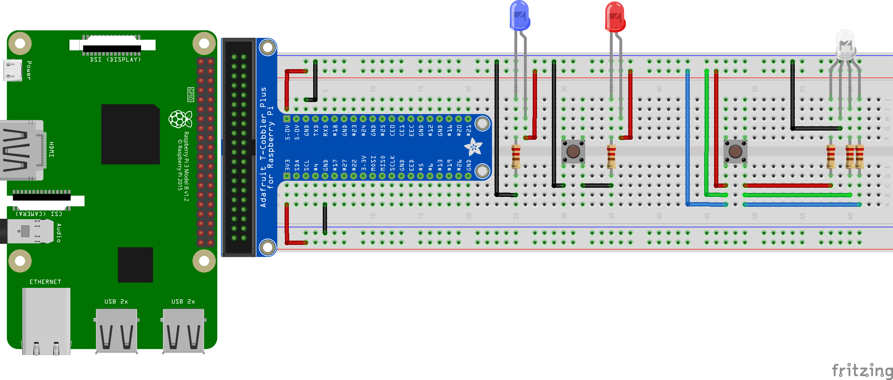

##### Week 01 Contents
- Presentation: [Syllabus Review, Course Objectives Discussion](week01/README.md)
- Code: [Python History and Philosophy](week01/python-philosophy.md)
- Code: [Terminal Basics](week01/terminal.md)
- Code: [Python Introduction and Data Manipulation](week01/python.md)
- Components: [Raspberry Pi, Breadboard, Jumper Cables, LED, Resistor, Pushbutton](week01/circuits.md)
- Homework: [Do some research, complete some Python examples, and setup your Raspberry Pi](week01/homework.md)

-----

### Components

#### Raspberry Pi 3b+

The [Raspberry Pi](https://en.wikipedia.org/wiki/Raspberry_Pi) is a single-board computers (a "system-on-a-chip" or SoC) developed by scientists at the University of Cambridge and produced in the UK for teaching computer science and electronic basics in educational settings. The RPi, as it is ofted called, is very popular in the electronics hobbyist community, having sold millions of units across several different versions and application spaces including robotics, scientific computation, home automation, game production, and connected object prototyping.

Unlike the related but often-confused [Arduino](https://en.wikipedia.org/wiki/Arduino) specification that exists to serve as an embedded microcontroller without user input, the Raspberry Pi is a standalone computer with usb, mouse, keyboard, sound, wifi, bluetooth, and HDMI video connections usable for interacting with its [Linux-based](https://en.wikipedia.org/wiki/Linux) [Raspbian](https://en.wikipedia.org/wiki/Raspbian) operating system. On its micro-SD card hard drive, users can produce music, play games, write code to control electronic devices, browse the internet, playback media, and anything one could do a traditional desktop machine — albeit at a much slower speed. The Raspberry Pi runs at 1.4GHz, with 1GB of usable RAM. For comparison, baseline MacBook Pros in 2019 also run at 1.4GHz (though they have 4 cores compared to the Pi's 1), with 8GB of RAM. Additionally, the RPi has 40 *general purpose input-output pins*, or GPIO, exposed which can be programmatically controlled in different ways, facilitating the integration of the Raspberry Pi with most small electronic components ever produced including sensors, LEDs and speakers, and screens and cameras.

We will be using the Raspberry Pi as the brain for our projects, creating and running software directly on the device for manipulating electronic components and incoming data. Outside of class, there are [dozens of things you can do with a Raspberry Pi](https://www.makeuseof.com/tag/different-uses-raspberry-pi/), and experimentation is encouraged!

#### Jumper Cable

More properly a *Dupont Cable*, but often just called *jumpers*, we use these to make electrical connections. The Raspberry Pi operates at very low power settings, with little risk of harming a developer. Nevertheless, better to make connections with wires than fingers! We will often use male->male jumper cables, though female->male and female->female connections are available as well.

Wiring can get confusing, do your best to encode your connection logic in your wire colors and use appropriate wire lengths. 

- Red for 5V Power
- Orange for 3V3 Power
- Black, White, Gray, or Brown for Ground
- Yellow or Purple for Generic Signals
- Green and Blue for I2C Communication

There are many alternatives to wires for making connections — conductive fibers and textiles, silver particle suspension ink, solder, human skin... 

#### Breadboard

The breadboard looks like a boring piece of plastic with some holes in it. But, inside, there are some bits of metal that allows us to prototype connections much more easily, without needing to solder. In landscape orientation...

- Each of the *rows* of holes near the red and blue stripes — on both top and bottom of the breadboard — are connected all the way across. We call these the *rails* of the breadboard, and they are often used to manage power.

- Each of the *columns* inside the *rails* are connected vertically in sets of usually 5. This connection is broken across the middle of the bread board. Individual components often occupy several columns to get power and data in and out. 

#### LED (Light Emitting Diode)

LEDs convert electricity into light! They come in many different packages, colors, sizes, beam angles, and brightness levels. Each LED has an anode (long leg, current in) and a cathode (short leg, power out). Though LEDs are often rightfully praised for their low power requirements, high brightness LEDs and LED matrices/strips often require their own dedicated power supplies. Learn more about how LEDs work [here](https://learn.sparkfun.com/tutorials/light-emitting-diodes-leds).

#### Resistors

Resistors, small pieces of variably conductive ceramic material. are used for two common purposes.

- [Pull-down and pull-up resistors](https://www.electronics-tutorials.ws/logic/pull-up-resistor.html) are used in combination with buttons and other sensors to ensure that current flows and that the state of the pin is always known. In the case of the more common *pull-down resistor*, the goal is to resist all current flowing through the component and leave the component at a clear 0 voltage. In the case of a *pull-up resistor*, the weak resistor ensures the circuit is always receiving current. Without these resistors, component and pin electrical values would fluctuate, or *float*, between high and low and be unknown at any given time. 

- Resistors are also used to limit the amount of electrical power flowing through parts of a circuit, and are termed [current-limiting](https://www.build-electronic-circuits.com/current-limiting-resistor/) when used in this way. They are commonly paired with LEDs, which have very specific current requirements.

Get to know the resistor color code! The amount of electricity resisted by these little bits of ceramic is encoded in their colored stripes. We will talk about how to determine the most correct color code for any application using [Ohm's Law](https://en.wikipedia.org/wiki/Ohm%27s_law) in future weeks.

#### Pushbutton

Buttons are simple components in complex packagings. They are effectively broken wires, that are fully reconnected when the button is pressed down. This allows a user to control the flow of electrons. Buttons often have multiple exposed pins, allowing several connections to be made on a single press. Our simple pushbuttons have 4 legs total — permanently connected in sets of 2. On depression, all 4 legs get connected together.

Buttons come in [many different form factors and sizes](https://www.sparkfun.com/search/results?term=button) for different applications, with slightly different behaviors and defaults, but they all are wired up the same way.

----- 

### Circuits

#### LED Control

Control a set of LEDs by making connections with buttons.

-----

### Homework

#### LED Controller

With *at least 3 Buttons* and *at least 3 colored LEDS*, create an LED controller *on your breadboard*.

Imagine a scenario where such an object could offer utility to a certain user. Other than having a 1:1 relationship between buttons and LEDs, what could some other designed behaviors be? Could an additional button manage whether or not LEDs flash? Could multiple LEDs be active at once, and if so, how could button presses manage all the possible permutations? Prepare to present your work!

#### General Research

Browse both [sparkfun](www.sparkfun.com) and [adafruit](www.adafruit.com), fine purveyors of small electrical bits and pieces. Find at least 3 exciting components to share with the class next week.

#### Project Research

Given the small and dedicated class, perhaps the overarching course theme could be arrived at democratically. Read through some of these options, and bring a Post-It note that ranks the following...

a. Read through this [government grant from the Help America Vote Act](https://www.grants.gov/web/grants/search-grants.html?keywords=hava) that strives to improve America's *incredibly outdated and vulnerable* voting infrastructure for individuals with visual and physical impairments. The language is confusing and vague, so listen to [this short podcast](https://art19.com/shows/the-weeds/episodes/50ddf118-3914-4be9-aace-414c9c0e372b) as well to better understand the problem and opportunities at every level. 

b. Public safety in emerging economies is a constant topic worthy of design and technological intervention, and particularly so in places where autonomous vehicles will soon be introduced where *piloted vehicles* themselves were never commonplace. [Opportunities for public safety improvment](https://fas.org/sgp/crs/misc/R44940.pdf) — at the pedestrian, architectural, infrastructural, and vehicle level — and public grants abound. 

c. Epidemic spread is a growing concern in an increasingly interconnected world. Microbial sensors are finally available and ready to implement, but the [models used](http://www.gleamviz.org) to predict disease spread are not currently reinforced by any active sensor-derived data. Looking specifically at infection-spread in hospitals as a microcosm for global disease spread, is there a sensor-based intervention for tracking and ultimately predicting epidemic growth? Many grants exist for specific countries: for example, [Bangladesh](https://www.grants.gov/web/grants/search-grants.html?keywords=public%20safety%20vehicle%20autonomous).

d. Large multiples of sensors and actuators offer huge promise for immersive experiences, and require a special kind of programming logic and optimization. Check out the works of [Random International](https://www.random-international.com) to determine if working in multiples might be interesting to you. 

e. Alexa, Siri, and Google Assistant are nascent technologies that demand design consideration and implementation. Many of these systems are open source and ripe for activation and development. For example, the [AVS Platform](https://github.com/alexa/avs-device-sdk/wiki) gives any designer a turn-key method to embed Alexa's intelligence and reponsiveness in any physical object with an embedded Raspberry Pi microcontroller. Perhaps we could focus on voice interfaces this semester?

f. If you were to work on a personal project that involves coding/electronics, do you have anything ready to go? 