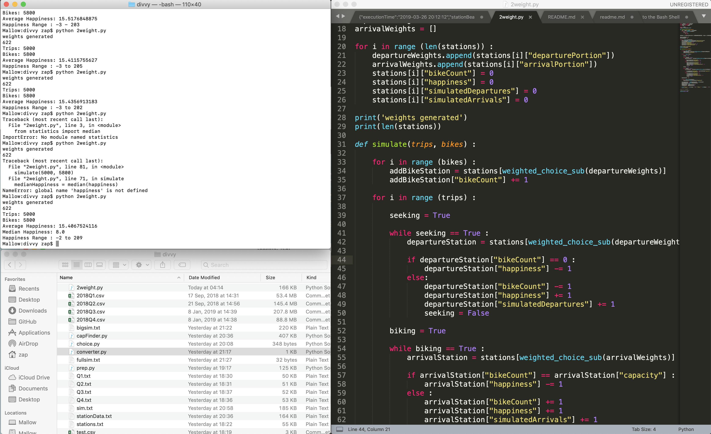

##### Week 02 Contents
- Presentation: [Installation, Inclusive Design Conversation](readme.md)
- Code: [Moving around with Terminal](terminal.md)
- Code: [Python Basics](python-basics.md)
- Homework: [Readings, API Access, Programming Practice](homework.md)

-----

### Intro to Python

##### Working in Python

The process for creating and running Python code is a bit obtuse. We will need easy access to a directory full of Python files and other assets, a Terminal emulator (the built-in [Terminal](https://support.apple.com/guide/terminal/welcome/mac) application for macOS or Linux, or [Cygwin](https://www.cygwin.com) for Windows) to run our completed code, as well as some sort of text editor for actually writing code (such as the cross-platform [Sublime](https://www.sublimetext.com)).

Setting up your desktop with the following format as a starting point is advisable.



-----

##### Printing to the Console and Running Python Code

The standard [Hello world](https://en.wikipedia.org/wiki/%22Hello,_World!%22_program) program, often used to demonstrate basic competency in a new programming language, is super easy in Python.

```python
print("Hello world")
```

We will need to type that bit of code into a new file in Sublime and save it as the file `hello.py`. To unify our processes, let's all make a new folder called `python_intro` on our Desktop. We can move into this new folder in our Terminal.


> `cd ~/Desktop/python_intro/`

To run our Python code, we simply use the Terminal command `python`.


> `python hello.py`

```
Hello World
```

We have officially written and executed Python code! :clap:

-----

##### Comments

Comments are text that are humand-readable, and ignored by the computer. Take notes by using comments directly in code!

You can write comments in Python by typing the `#` character and following it up with text on a single line.

```python
# this is a note that the computer doesn't see!
print("Hello world") #this prints text to the console
```

Multi-line comments use three quotation characters to begin and end the comment.

```python
"""
This says hello
to everyone
all over the planet
"""

print("Hello " + "World") 
#we can glue text together with the addition sign
```

-----

##### Variables
It is easy to make a container for information, called a `variable` in Python -- and you don't even need to know what kind of information it will store (unlike many other programming languages). The technical term for this behavior is that Python is a *dynamically-typed* language.

```python
name = "Zach"
siblingCount = "1"

print(name + " has " + str(siblingCount) + "sibling(s)")
```

Note that, in order to print `siblingCount`, we must convert it to a *String* (letters) format with `str()`. Variables can hold whatever data, but in Python it is often helpful and/or necessary to force a data type when that information is used.

-----

##### Python Maths
Manipulating numbers is very important for data manipulation and analysis in any programming language.

There are two kinds of numbers in Python:

- Integers are positive or negative counting numbers, and 0: `...-3, -2, -1, 0, 1, 2, 3...`
- Floats are positive or negative real numbers, containing an arbitrary number of decimal points: `3.0, 3.1, 3.14, 3.1415...`

In Python 2...

```python
print(7 + 5) 
#addition - returns 12

print(7 - 5) 
#subtraction - returns 2

print(7 * 5) 
#multiplication - returns 35

print(7 ** 5) 
#exponentiation - returns seven to the fifth power, 16807

print(7 ** .5) 
#exponentiation - returns the square root of seven, 2.6457513110645907

print(7 / 5) 
#integer division - returns 1 (two integers in a division problem will always return an integer!)

print(7.0 / 5) 
#float division - returns 1.4 (the presence of a single float triggers decimal division)

print(7.0 / 5.0) 
#float division - returns 1.4 (two floats also triggers decimal division)

print(7 % 5) 
#modulo - returns 2, the remainder of the integer division problem

print( abs(-7) )
#absolute value - returns 7
```

Note that division behaves a bit strangly, and differently between Python 2 vs Python 3! 

In Python 3...

```python
print(7 / 5) 
#float division - returns 1.4 (two integers in a division problem will always return an integer!)
#python 2 does integer division here

print(7.0 / 5) 
#float division - returns 1.4 (the presence of a single float triggers decimal division)
#same between Python 2 and 3

print(7.0 / 5.0) 
#float division - returns 1.4 (two floats also triggers decimal division)
#same between Python 2 and 3

print(7.0 // 5.0) 
#forced integer division - returns 1
#python 2 returns 1.0, the float version of interger division, which is kind of useless
```

Incrementally changing existing numerical data is also straightforward.

```python
number = 1

number += 12
#number = 13

number += 15
#number = 28

number += 1
#number = 29

number -= 15
#number = 14

number -= 12
#number = 2

print(number)
#returns 2

```

-----

##### Converting Data Types

Very often we need to convert data between different types to do what we need to do. We saw this before with `str()`, which allowed us to convert integers to text strings for printing statements that combined text and numbers.

```python
print( str(7) )
#returns "7", the text string version of the integer 7

print( str(7.0) )
#returns "7.0", the text string version of the float 7

print( int("7") )
#returns 7

print( float(7) )
#returns 7.0

print( hex(7) )
#returns 0x7, '0x' always indicates a hexadecimal (base 16) number

print( hex(12) )
#returns 0xc, the hexadecimal version of 12
#we can count in hexadecimal...
#0x0,0x1,0x2,0x3,0x4,0x5,0x6,0x7,0x8,0x9,0xa,0xb,0xc,0xd,0xe,0xf,0x10,0x11,0x12,0x13...

print ( oct(7) )
#returns 0o7, '0o' always indicates an octal (base 8) number

print ( oct(12) )
#returns 0o14, 
#we can count to 20 in octals...
#0o0,0o1,0o2,0o3,0o4,0o5,0o6,0o7,0o10,0o11,0o12,0o13,0o14,0o15,0o16,0o17,0o20,0o21,0o22,0o23...

print ( bin(7) )
#returns 0b111, '0b' always indicates a binary (base 2) number

print ( bin(12) )
#returns 0b1100
#we can count to 20 in binary...
#0b0,0b1,0b10,0b11,0b100,0b101,0b110,0b111,0b1000,0b1001,0b1010,0b1011,0b1100,0b1101,0b1110,0b1111,0b10000,0b10001,0b10010,0b10011
```

-----

##### Indentation and Simple Loops
Some languages use curly braces `{}` and parentheses `()` or other formatting characters to determine which code is subordinated to other code. Often, programmers use indentation to show these relationships, as these formatting characters can be easily missed. Python does not use curly braces, and instead simply makes use of indentation directly. Note the important, and easy to overlook, colon `:`.

```python
# run a loop 10 times, starting at 0 and ending at 9
for i in range(10) :
    print("Hello " + str(i) + " times")
```

```
Hello 0 times
Hello 1 times
Hello 2 times
Hello 3 times
Hello 4 times
Hello 5 times
Hello 6 times
Hello 7 times
Hello 8 times
Hello 9 times
```

Note the indentation of the print statement, which tells Python that the `print()` code should be included in the loop.

The variable `i` is called the *iterator*. It is, by default increased by one for each loop. Also, by default, our `range()` starts at `0` and ends before the given argument (here 10). The iterator never becomes the number passed as the argument to `range()`!

We can control all these behaviors by providing more arguments to `range()`.

```python
# run a loop 10 times, starting at 5 and ending at 11, jumping up by 3
for i in range(5,12,3) :
    print("Hello " + str(i) + " times")
```

```
Hello 5 times
Hello 8 times
Hello 11 times
```

-----

##### Conditions

Conditions work the same way as loops.

A simple conditional might have only a single check.

```python
# weather model
tempThreshold = 72

tempToday = 35

if tempToday < tempThreshold :
    print("It's cold today")
else :
    print("It's hot today")
```

A more advanced conditional might have many branching options. Note that Python uses the strange `elif` rather than spelling out `else if`. 

```python
# better weather model
tempHigh = 85
tempLow = 65

tempToday = 73

if tempToday < tempLow :
    print("It's cold today")
elif tempToday > tempLow and tempToday < tempHigh :
    print("It's pleasant today")
else :
    print("It's hot today")
```

You can use the following comparison operators in conditionals

```
a == b : true if a is exactly equal to b
a < b  : true if a is less than b
a <= b : true if a is less than or equal to b
a >= b : true if a is greater than or equal to b
a > b  : true if a is greater than b
a != b : true if a does not equal b
```

-----

##### Random 

We can inject additional *modules* of functionality to the core Python library by *importing* different functionalities. For example, random numbers cannot be generated by core Python, so were we to need variability or unpredictability in our code, we could import the *Random* module into our Python program.

After importing this *module*, if we want random integers, we can use `random.randint()`.

```python
import random

for i in range(10) :
	#print a random integer between 0 and 5, inclusive
	print(random.randint(0,5))
```

```
0
5
4
4
1
0
1
4
2
1
```

If we want a random number with decimals (called a "floating point number" by developers), we can instead use `random.uniform()`.

```python
import random

for i in range(10) :
	#print a random number, uniformly weighted, between 0 and 1, inclusive
	print(random.uniform(0,1))
```
```
0.8481560825317095
0.4862262467005589
0.7584955629755024
0.1872005446615962
0.3192872946043329
0.5031837342933824
0.5734300895869947
0.7422321630327087
0.8537804130068116
0.0239247940520823
```

-----

##### User Input

We can create simple textual user interfaces by asking Python to wait to receive input from a user.

* For Python 2*
```python
name = raw_input("What is your name?") 
siblingCount = raw_input("How many siblings do you have?") 

print(name + " has " + siblingCount + "sibling(s)")
```

Run this, and Python will ask you questions! 

Note that `raw_input()` takes all input as strings, so we did not need to convert `siblingCount` with `str()`. To do math on `siblingCount` on the other hand, we would have needed to convert it with `int()`.

Python 2 also has an `input()` command, which expects *python code* as input, rather than text. It assumes whatever is typed in is Python code, or known variable names. If you would like to use this `input()`, to maintain code compatibilty with Python 3, you would need to enclose any strings in quotations.


* For Python 3*
```python
name = input("What is your name?") 
siblingCount = input("How many siblings do you have?") 

print(name + " has " + str(siblingCount) + "sibling(s)")
```

Note that `input()` does not manage datatypes for you and assumes all `input` responses are strings, even numbers. We can also catch incorrectly typed user input by asking Python to `try` something, and if it fails, printing a useful error message.

```python
firstNumber = input("Enter the first number to multiply:")
secondNumber = input("Enter the second number to multiply:") 

try : 
    answer = float(firstNumber) * float(secondNumber)
    print(str(firstNumber) + " * " + str(secondNumber) + " = " + str(answer))

except ValueError:
    print("Please only enter numbers!")
```

A `ValueError` occurs when we try to do math on words, and so this code structure checks for incorrent user entries.

