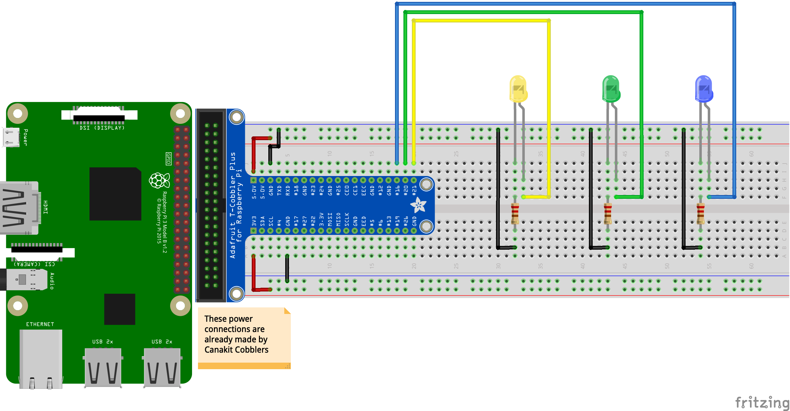

##### Week 04 Contents
- Presentation: [Electrical Signalling, Inclusive Carshare+Design Principles](readme.md)
- Components: [Multi LED Circuit](circuits.md)
- Homework Review: [Divvy API Access Code](homework-answers.md)
- Code: [Python GPIO Control](python-gpio.md)
- Homework: TBD Based on Class Progress

-----

### Circuits

#### Multi LED Circuit

Control multiple LEDs with Python by making a few connections. Check out the code for this circuit on the [GPIO Control](python-gpio.md) page.

To understand why resistors are needed in this circuit, and why the 220 ohm resistor was chosen, take a look at this excellent [Sparkfun explainer](https://learn.sparkfun.com/tutorials/voltage-current-resistance-and-ohms-law/electricity-basics).

