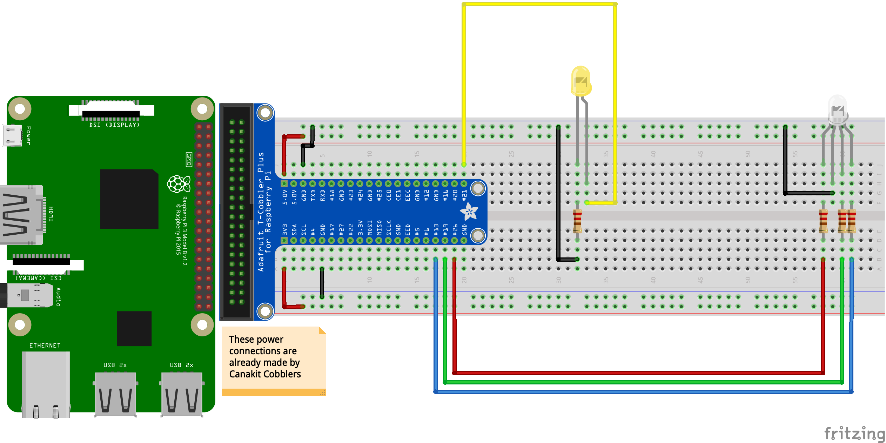

##### Week 04 Contents
- Presentation: [Electrical Signalling, Inclusive Carshare+Design Principles](readme.md)
- Components: [RGB LED Circuit](circuits.md)
- Homework Review: [Divvy API Access Code](homework-answers.md)
- Code: [Python GPIO Control](python-gpio.md)
- Homework: TBD Based on Class Progress

-----

### Components

#### RGB LED (Common Cathode)

Effectively three LEDs in one package -- this component is used to mix custom colored lights and produce dynamically animated hues. RGB LEDs have three independently controllable subdiodes for red, green, and blue light. Common Cathode RGB LEDs, like the ones that come in our kits, combine *ground* for all three of the internal LEDs. Common *Anode* RGB LEDs, also available and more common in higher quality LEDs, combine *voltage in* with each color receiving its own ground pin.

Review [additive color mixing principles](https://en.wikipedia.org/wiki/Additive_color) to better understand why red + green does not make brown! 

----- 

### Circuits

#### Color Control

Control color with Python by making a few connections. Check out the code for this circuit on the [GPIO Control](python-gpio.md) page.

To understand why resistors are needed in this circuit, and why the 220 ohm resistor was chosen, take a look at this excellent [Sparkfun explainer](https://learn.sparkfun.com/tutorials/voltage-current-resistance-and-ohms-law/electricity-basics).

