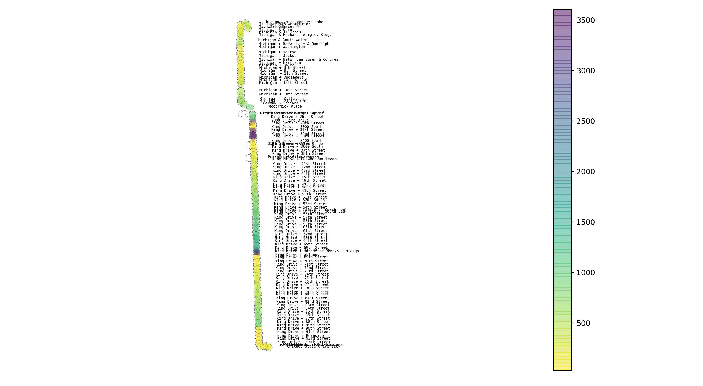

##### Week 06 Contents
- Presentation: [Everyone's Research on Station Accessibility](readme.md)
- Code: [Python Data Plotting with MatPlotLib](python-plotting.md)
- Homework Review: [Transit Availability Visualizer with Add-Ons](homework-answers.md)
- Homework: [Readings, Plotting](homework.md)

-----

### Python Plotting with MatPlotLib

##### Plotting Buses



This code reaches out to the Bus Tracker API, and plots the arrival time of predicted buses [in data-derived colors](https://matplotlib.org/3.1.0/tutorials/colors/colormaps.html) along an entire bus route using the incredible [matplotlib](https://matplotlib.org). 

```python
import requests
import json
from datetime import datetime
import time
#import RPi.GPIO as GPIO     
import matplotlib.pyplot as plt

#############################################

#personal API key
key = "WsNRBxSRFu9zC77ZQAESXtnBY"

#you can get a list of route codes at...
# http://www.ctabustracker.com/bustime/api/v2/getroutes?format=json&key=...
route = 3

#if you have a route, you can get the directions a bus travels
#http://www.ctabustracker.com/bustime/api/v2/getdirections?format=json&rt=3&key=...
direction = "Southbound"

#build API url for accessing stop coordinates
stopUrl = "http://www.ctabustracker.com/bustime/api/v2/getstops?key=" + key + "&rt=" + str(route) + "&dir=" + direction + "&format=json"

#get stops 
response = requests.get(stopUrl)

#parse data as json
busStops = response.json()["bustime-response"]["stops"]

#lists for plotting stops
stopsLon = []
stopsLat = []

#lists for plotting approaching bus colors
lon = []
lat = []
colors = []

#consult https://matplotlib.org/3.1.1/api/text_api.html#matplotlib.text.Text for styline options
stopLabelFont = {'fontfamily':'monospace', 'fontsize' : 5}


#loop through the stops
for i in range(len(busStops)) :
    #label each stop with its name. 
    plt.text(busStops[i]["lon"] + .01, busStops[i]["lat"], busStops[i]["stpnm"], stopLabelFont)
    #add coordinates to our list for plotting
    stopsLon.append(busStops[i]["lon"])
    stopsLat.append(busStops[i]["lat"])

#create scatter plot of stops. more settings https://matplotlib.org/3.1.1/api/_as_gen/matplotlib.pyplot.scatter.html
plt.scatter(stopsLon, stopsLat, alpha=1, s=100, c="none", linewidth=.2, edgecolors='black')

#loop through stops again...
for i in range(len(busStops)):
    #there will likely be errors in the data, so we can catch them here
    try:
        #build API url for single stop predictions
        urlSingleStop = "http://www.ctabustracker.com/bustime/api/v2/getpredictions?key=" + key + "&rt=" + str(route) + "&stpid=" + str(busStops[i]["stpid"]) + "&dir=" + direction + "&format=json"
        #ask API for data
        responseSingleStop = requests.get(urlSingleStop)
        #parse data as json
        dataSingleStop = responseSingleStop.json()
        #strip away some unnecessary data 
        nextBusSingleStop = dataSingleStop["bustime-response"]["prd"][0]
        #the api gives a predicted arrival time. there is also a predictive countdown in "prdctdn", but that behaves strangely!
        predictedArrivalTimeStringSingleStop = nextBusSingleStop["prdtm"]
        #record current moment
        now = datetime.now()
        #create a time object so we can do time math
        timeObjectSingleStop = datetime.strptime(predictedArrivalTimeStringSingleStop, "%Y%m%d %H:%M")
        #determine how much time is left until bus arrives
        timeDifferenceSingleStop = timeObjectSingleStop - now
        #number of seconds until predicted bus arrival
        secondsTillArrivalSingleStop = timeDifferenceSingleStop.seconds

    except :
        #if there was a data access error, debug!
        print("data problem at " + busStops[i]["stpnm"])

    else : 
        #weird that it's considered 'else,' but this is if there was *no* errors caught in the try block
        #add our coordinates
        lon.append(busStops[i]["lon"])
        lat.append(busStops[i]["lat"])
        #some bus stations have a next arrival time that is a day away, which throws off our colors! 
        #this checks if the bus is more than an hour away, and flattens the max arrival time to an hour
        if secondsTillArrivalSingleStop < 3600   :
            colors.append(secondsTillArrivalSingleStop)
        else : 
            colors.append(3600)

#data is processed, so let's draw the scatter plot!
#possible color maps https://matplotlib.org/3.1.0/tutorials/colors/colormaps.html
plt.scatter(lon, lat, alpha=0.5, s=80, c=colors, cmap="viridis_r", edgecolors='none')

#set title
plt.set_title('CTA Route ' + str(route))

#how to add labels to our axes
plt.ylabel("Latitude")
plt.xlabel("Longitude")

#show grid
plt.grid(True)
#show color bar legend
plt.colorbar() 
#keep lat and lon equal - forces plat caree projection 
plt.axis('equal')
#turn off axes display
plt.axis('off')

#to limit the viewport of the plot
#plt.xlim(-87.625,-87.615)
#plt.ylim(41.725,41.9)

#show the stupid plot!!!
plt.show()
```
