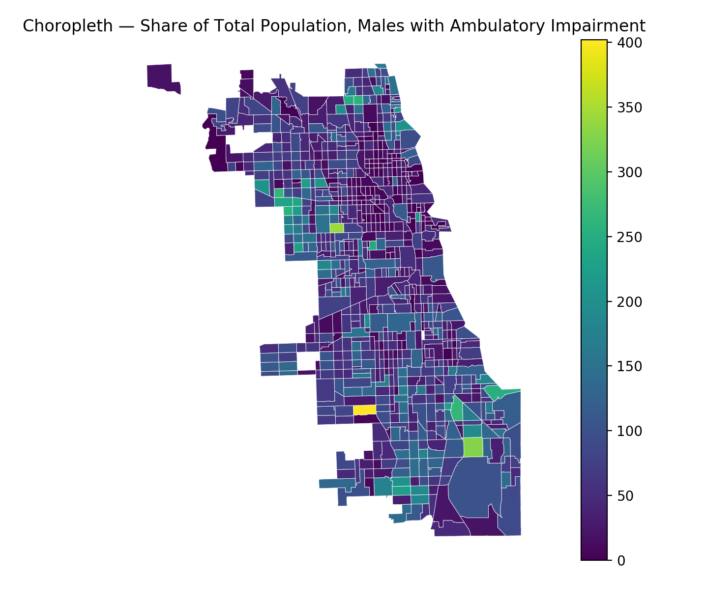

##### Week 07 Contents
- Presentation: [Census](readme.md)
- Code: [Working with the Census API](census-api.md)
- Code: [Python Census Data Plotting](census-plotting.md)
- Homework: TBD

----------

### Plotting Census Data in Python on Shapefiles as Choropleth

##### Download Geographic Data

To plot data from the census, we need matching geographic data. Data in the census is indexed to geographic entities according to this schema:


For today, we'll be working at the tract level. Download this [shapefile](https://www.chicago.gov/city/en/depts/doit/dataset/boundaries_-_censustracts.html) and ensure that it sits next to your Python code in your file system. 

Use the incredibly useful [mapshaper](https://mapshaper.org) to preview the downloaded census tract shapefile and interrogate the data embedded within. [Spatial Reference](https://spatialreference.org) is also an amazing resource, referenced contextually in the code below. 

-----

##### Data Merging in Python

Use our standard Python API access code, along with some new utilities such as [pandas](https://pandas.pydata.org) and [geopandas](http://geopandas.org), to merge indexed geographic and sociological data. Here, we are merging based on census tract FIPS code, present in both datasets.



```python
#necessary modules
import requests
import json
import time
import matplotlib.pyplot as plt
import geopandas as gpd
import pandas as pd

#key for census API
censusKey = "2c0f99a658204b8f07b78835951581be69befd87"

#census variables of interest
dataPoints = "B18105_002E,B18105_004E,B18105_007E,B18105_010E,B18105_013E"

#construct census API
#17 is FIPS for Illinois, 031 is FIPS for Cook County
url = "https://api.census.gov/data/2017/acs/acs5?get=NAME,B01001_001E," + dataPoints + "&for=tract:*&in=state:17&in=county:031&key=" + censusKey

#grab data and parse
censusResponse = requests.get(url).json()


#create empty list as a future data container
dataList = []

#loop through census data -- note that we start at index "1" because the first data entry is a header row
for i in range (1, len(censusResponse)) : 

	#skip row, as there is no population at this census tract 
	if censusResponse[i][1] == "0":
		#skip!
		pass
	#all the rows that show a population
	else:
		#create dictionary of meaningful data pre-computed
		dataList.append(
			{
				"name": censusResponse[i][0],
				"totalPopulation": int(censusResponse[i][1]),
				"totalMale": int(censusResponse[i][2]),
				"5-17": int(censusResponse[i][3]),
				"18-34": int(censusResponse[i][4]),
				"35-64": int(censusResponse[i][5]),
				"65-74": int(censusResponse[i][6]),
				"totalMaleAmbulatoryDisability": int(censusResponse[i][3]) + int(censusResponse[i][4]) + int(censusResponse[i][5]) + int(censusResponse[i][6]),
				"percentageMaleAmbulatoryDisability": ( int(censusResponse[i][3]) + int(censusResponse[i][4]) + int(censusResponse[i][5]) + int(censusResponse[i][6]) ) / int(censusResponse[i][1]),
				"tractCode" : censusResponse[i][9]
			}
		)


#convert data into a pandas data frame, which is like an excel table in code
frame = pd.DataFrame(dataList) 
 
#preview first 10 lines of data fram 
print(frame.head)

#load shapefile and reproject to a better map projection
#you can look up EPSG map projection coded here...
#https://spatialreference.org
#2790 is a good choice for north-eastern IL
geography = gpd.read_file('bounds/geo_export_ea609890-7468-44a7-99ef-edc77453045d.shp').to_crs(epsg=2790)

#combine data! 
#left_on is the column header for the *geography*, the data receiving the merged data
#right_on is the column header in the data frame from the *census*, the data being injected in the merge
merged = geography.merge(frame, left_on='tractce10', right_on='tractCode')

#print(merged.head)
#draw map!
#color maps here: https://matplotlib.org/3.1.0/tutorials/colors/colormaps.html
#legend=True shows the color map bar
merged.plot(column="totalMaleAmbulatoryDisability", cmap='viridis', linewidth=0.3, edgecolor='#ffffff', legend=True)

plt.title("Choropleth — Share of Total Population, Males with Ambulatory Impairment")
#turn off axes display, doesn't make much sense for a map
plt.axis('off')

#show the stupid plot!
plt.show()
```