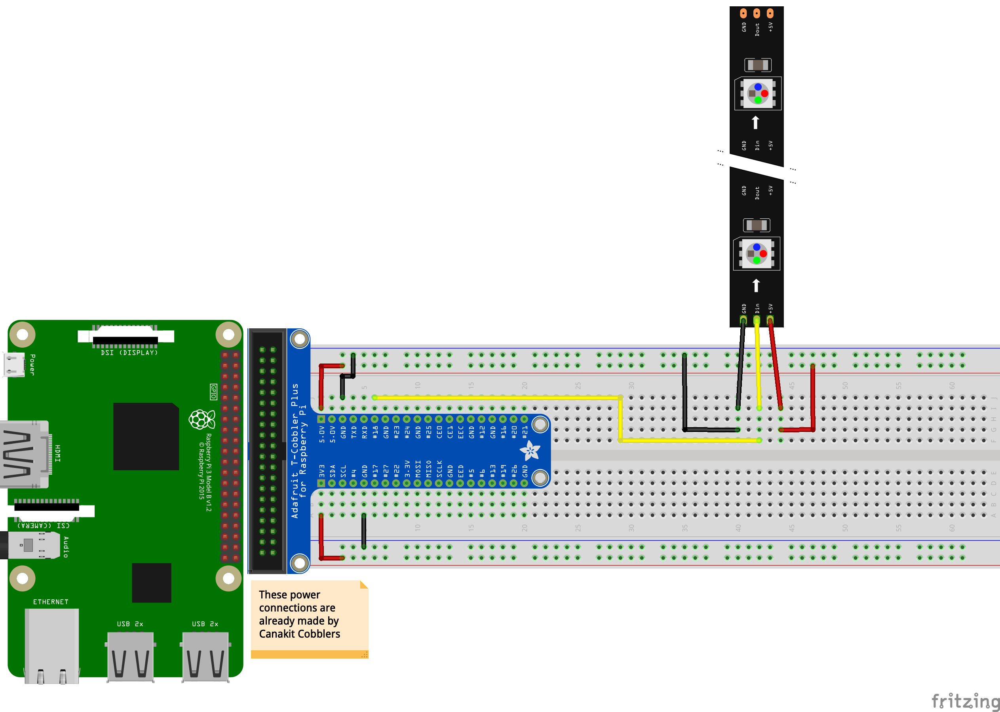

##### Week 09 Contents
- Presentation: [Updating, Installing, Soldering and Related Skills](readme.md)
- Components: [RGB LED Strips (Neopixels)](circuits.md)

-----

### Components

#### RGB LED Strip (WS2812)


A series of LEDs, all wired together, that can be addressed in code with simple Python methods. Amazing, bright, cheap, easy. Learn more at the [Adafruit overview](https://learn.adafruit.com/neopixels-on-raspberry-pi/overview).

Be aware that the LED strip has [very specific power requirements](https://learn.adafruit.com/adafruit-neopixel-uberguide/powering-neopixels). For easy math, assume each LED needs 60mA of power at max white brightness -- so your power supply needs to be able to supply `(60 * Number of LEDs) / 1000` amps of power. Very often, we would want to use a separate power supply allocated just for the LED strips if many lights are needed, for example in architectural applications.


Never buy the over-priced [Philips Hue light strips](https://www.amazon.com/Philips-Ambiance-LightStrip-Compatible-Assistant/dp/B0167H33DU)! You can instead get inexpensive, [standard WS2812 led strips](https://www.amazon.com/gp/product/B00VQ0D2TY/ref=ppx_yo_dt_b_asin_title_o00_s00?ie=UTF8&psc=1) and a compatible [IoT controller](https://www.amazon.com/Zigbee-Controller-Compatible-Lightify-Control/dp/B07FTD9H7T/ref=sr_1_1_sspa?keywords=hue+compatible+led+controller&qid=1571767266&s=hi&sr=1-1-spons&psc=1&spLa=ZW5jcnlwdGVkUXVhbGlmaWVyPUEzMFo1R0E1NjRJVVRDJmVuY3J5cHRlZElkPUEwMDIyMzg5MVdJUExTVzE5TEZBQiZlbmNyeXB0ZWRBZElkPUEwMjgwODcyMVQxR05TNEJJVlVIUyZ3aWRnZXROYW1lPXNwX2F0ZiZhY3Rpb249Y2xpY2tSZWRpcmVjdCZkb05vdExvZ0NsaWNrPXRydWU=).

----- 

### Circuit

##### Up to 16 LEDs with a 1 Amp Power Supply

(60 * 16) / 1000 = .96 Amps -- doable with just 1 amp of available power, but just barely.



-----

### Adafruit's Sample Code for NeoPixels

We'll discuss this code next week, it's weird!

```python
#!/usr/bin/env python3
# NeoPixel library strandtest example
# Author: Tony DiCola (tony@tonydicola.com)
#
# Direct port of the Arduino NeoPixel library strandtest example.  Showcases
# various animations on a strip of NeoPixels.

import time
from neopixel import *
import argparse

# LED strip configuration:
LED_COUNT      = 16      # Number of LED pixels.
LED_PIN        = 18      # GPIO pin connected to the pixels (18 uses PWM!).
#LED_PIN        = 10      # GPIO pin connected to the pixels (10 uses SPI /dev/spidev0.0).
LED_FREQ_HZ    = 800000  # LED signal frequency in hertz (usually 800khz)
LED_DMA        = 10      # DMA channel to use for generating signal (try 10)
LED_BRIGHTNESS = 255     # Set to 0 for darkest and 255 for brightest
LED_INVERT     = False   # True to invert the signal (when using NPN transistor level shift)
LED_CHANNEL    = 0       # set to '1' for GPIOs 13, 19, 41, 45 or 53


# Define functions which animate LEDs in various ways.
def colorWipe(strip, color, wait_ms=50):
    """Wipe color across display a pixel at a time."""
    for i in range(strip.numPixels()):
        strip.setPixelColor(i, color)
        strip.show()
        time.sleep(wait_ms/1000.0)

def theaterChase(strip, color, wait_ms=50, iterations=10):
    """Movie theater light style chaser animation."""
    for j in range(iterations):
        for q in range(3):
            for i in range(0, strip.numPixels(), 3):
                strip.setPixelColor(i+q, color)
            strip.show()
            time.sleep(wait_ms/1000.0)
            for i in range(0, strip.numPixels(), 3):
                strip.setPixelColor(i+q, 0)

def wheel(pos):
    """Generate rainbow colors across 0-255 positions."""
    if pos < 85:
        return Color(pos * 3, 255 - pos * 3, 0)
    elif pos < 170:
        pos -= 85
        return Color(255 - pos * 3, 0, pos * 3)
    else:
        pos -= 170
        return Color(0, pos * 3, 255 - pos * 3)

def rainbow(strip, wait_ms=20, iterations=1):
    """Draw rainbow that fades across all pixels at once."""
    for j in range(256*iterations):
        for i in range(strip.numPixels()):
            strip.setPixelColor(i, wheel((i+j) & 255))
        strip.show()
        time.sleep(wait_ms/1000.0)

def rainbowCycle(strip, wait_ms=20, iterations=5):
    """Draw rainbow that uniformly distributes itself across all pixels."""
    for j in range(256*iterations):
        for i in range(strip.numPixels()):
            strip.setPixelColor(i, wheel((int(i * 256 / strip.numPixels()) + j) & 255))
        strip.show()
        time.sleep(wait_ms/1000.0)

def theaterChaseRainbow(strip, wait_ms=50):
    """Rainbow movie theater light style chaser animation."""
    for j in range(256):
        for q in range(3):
            for i in range(0, strip.numPixels(), 3):
                strip.setPixelColor(i+q, wheel((i+j) % 255))
            strip.show()
            time.sleep(wait_ms/1000.0)
            for i in range(0, strip.numPixels(), 3):
                strip.setPixelColor(i+q, 0)

# Main program logic follows:
if __name__ == '__main__':
    # Process arguments
    parser = argparse.ArgumentParser()
    parser.add_argument('-c', '--clear', action='store_true', help='clear the display on exit')
    args = parser.parse_args()

    # Create NeoPixel object with appropriate configuration.
    strip = Adafruit_NeoPixel(LED_COUNT, LED_PIN, LED_FREQ_HZ, LED_DMA, LED_INVERT, LED_BRIGHTNESS, LED_CHANNEL)
    # Intialize the library (must be called once before other functions).
    strip.begin()

    print ('Press Ctrl-C to quit.')
    if not args.clear:
        print('Use "-c" argument to clear LEDs on exit')

    try:

        while True:
            print ('Color wipe animations.')
            colorWipe(strip, Color(255, 0, 0))  # Red wipe
            colorWipe(strip, Color(0, 255, 0))  # Blue wipe
            colorWipe(strip, Color(0, 0, 255))  # Green wipe
            print ('Theater chase animations.')
            theaterChase(strip, Color(127, 127, 127))  # White theater chase
            theaterChase(strip, Color(127,   0,   0))  # Red theater chase
            theaterChase(strip, Color(  0,   0, 127))  # Blue theater chase
            print ('Rainbow animations.')
            rainbow(strip)
            rainbowCycle(strip)
            theaterChaseRainbow(strip)

    except KeyboardInterrupt:
        if args.clear:
            colorWipe(strip, Color(0,0,0), 10)
 ```