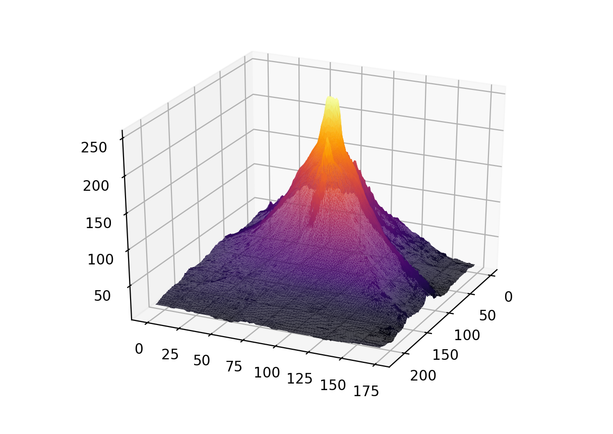

##### Week 10 Contents
- Presentation: [Algorithmic Graphics and Form](readme.md)
- Code: [Coding an Image](image.md)
- Code: [MatPlotLib 3D](matplotlib3d.md)
- Code: [Heightfields](heightfield.md)
- Homework: [LED Strips, Image Manipulation, and Heightfields](homework.md)

-----

### Heightfields

We can combine everything that came before this week into a [heightfield/heightmap](https://en.wikipedia.org/wiki/Heightmap), an image-based method of compressing 3D information. In a heightfield image, grayscale values are used to represent elevation. Black is often sea level, and white is mountain peaks. This technique is used in every video game and Pixar movie ever made, and makes storage of large 3D terrains possible. For example, this small heightfield represents terrain data for Mount Kilimanjaro, sourced from [infrared mapping satellites](https://en.wikipedia.org/wiki/Shuttle_Radar_Topography_Mission) participating in global [Digital Elevation Modeling](https://en.wikipedia.org/wiki/Digital_elevation_model) projects. 

This [awesome website](http://terrain.party) makes it easy to grab topographic heightfields. But, the (seemingly broken?) interface makes grabbing your preferred areas difficult. So, think like a programmer! We can hack the URLs to grab what we need...

```
http://terrain.party/api/export?name=maybekentucky&box=-86.657427,35.764666,-86.856702,35.602969
```

The `name` key is meaningless, but you can set it to whatever you like (just no special characters or spaces). The `box` key is more interesting, and takes four values in order: the eastern bounding line of longitude, the southern bounding line of latitude, the western bounding line of longitude, and finally the northern bounding line of latitude. This is the order that computers tend to understand [circular logic](https://en.wikipedia.org/wiki/Unit_circle) (clockwise, starting from the east).

## Beware that large images will likely crash matplotlib! Best to resize your heightfield images before projecting them into 3D to no more than 250px on their longest side. You can do this in Photoshop or any other image editing program. It is also recommended that you convert any heightfield image to RGB color mode for best results (also through Photoshop "Image" -> "Mode" -> "RGB Color").




```python
from PIL import Image
#for 3d projection and interaction
from mpl_toolkits.mplot3d import Axes3D
#for plotting
import matplotlib.pyplot as plt
#for faster processing and power
import numpy as np

import random

#make a figure
fig = plt.figure()
#set up an subplot in 3D 
ax = ax = fig.add_subplot(111, projection='3d')

#open an image
img = Image.open("kili_crop.jpg")

#get rgb pixel data out of image
pixels = list(img.getdata())

#extract native image size
width, height = img.size

# simple perceptual luminance algorithm from here...
# https://www.scantips.com/lumin.html
def computeBrightness(rgb):
	return ( (rgb[0] * .3) + (rgb[1] * .59) + (rgb[2] * .11) )

x = []
y = []
z = []


#make a figure
fig = plt.figure()
#set up an subplot in 3D 
ax = ax = fig.add_subplot(111, projection='3d')

x = []
y = []
z = []

#construct data
for i in range(height):
	for j in range(width):
		#create a regular grid of points
		x.append(j)
		y.append(i)


for i in range(len(pixels)):
	z.append(computeBrightness(pixels[i]))

# Plot the delaunay triangulation surface
surf = ax.plot_trisurf(x, y, z, cmap='inferno', antialiased=True)

#show the plot!
plt.show()
```