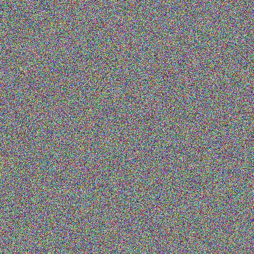
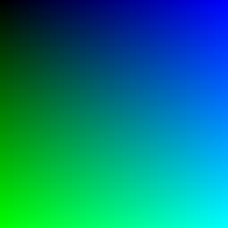
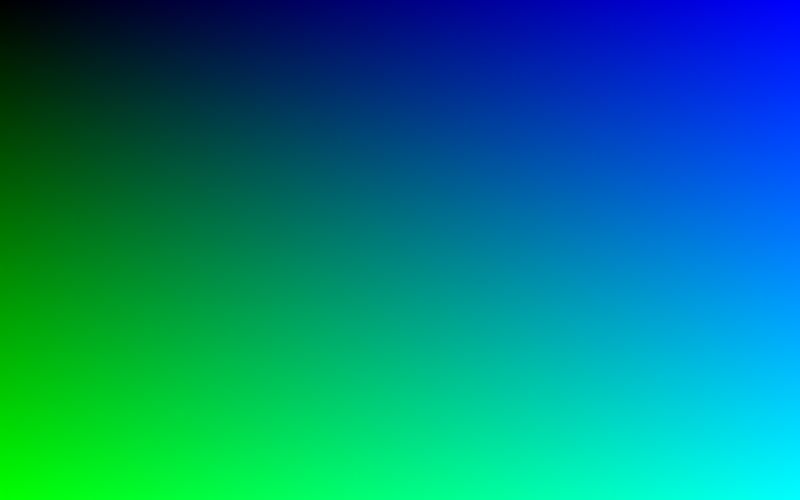
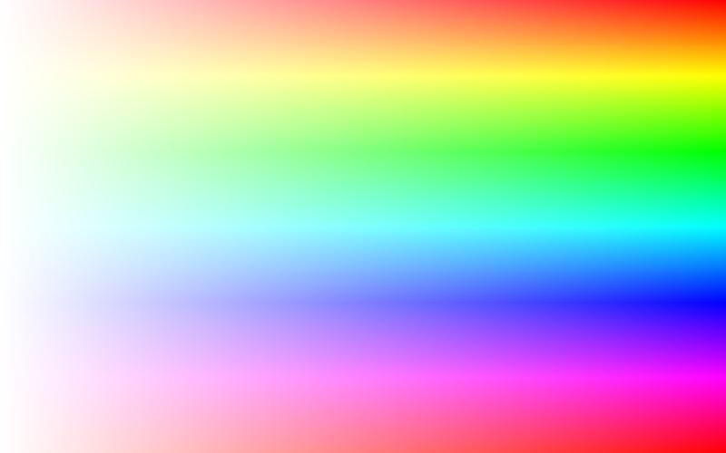
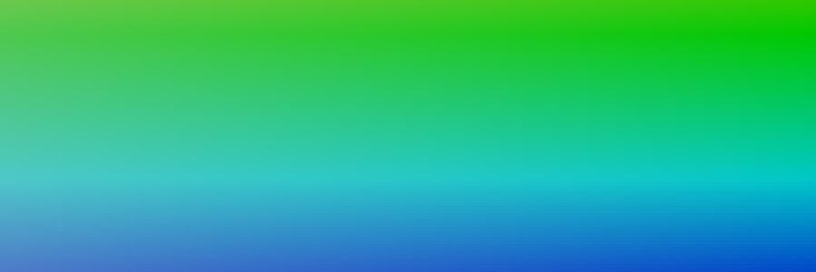
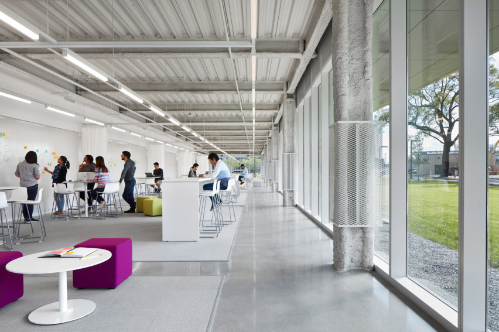
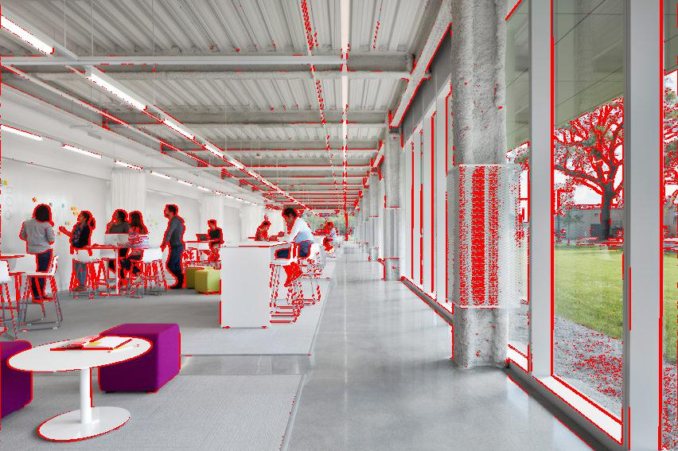

##### Week 10 Contents
- Presentation: [Algorithmic Graphics and Form](readme.md)
- Code: [Coding an Image](image.md)
- Code: [MatPlotLib 3D](matplotlib3d.md)
- Code: [Heightfields](heightfield.md)
- Homework: [LED Strips, Image Manipulation, and Heightfields](homework.md)

-----

### Creating Raster Images with Pillow

Using [Pillow](https://pillow.readthedocs.io/en/stable/), a Python module for working with raster images, we can not only read in images and manipulate the data, but also create pixel-based images from code.

Pillow is a very easy to use module that is well-documented. Unfortunately, it often *over-simplifies* its domain and makes it necessary to read the documentation very carefully. For example, rather than hold the data for a grid of pixel colors as a 2-dimensional list (row x column), it instead requires our code to have *no structure* and instead feed in a single dimensional list [pixel, pixel, pixel...]. You then set the width x height structure when you render or save the image. Weird, but easier, maybe?

To create a simple image with pixels of random colors, take a look at the following code...

```python
from PIL import Image
import random

#list to hold pixel data
colors = []

height = 500
width = 500

#let green values increase along the y dimension of the image
for y in range(height):
	#let blue values increae along the x dimension of the image
	for x in range(width):
		#create a list of values representing a single pixel's color from 3 random numbers
		rgb = [random.randint(0,255), random.randint(0,255), random.randint(0,255)]
		#add the current pixel to the ongoing data list
		colors.extend(rgb)

# Convert list to bytes, necessary for Pillow
colors = bytes(colors)

#create an image!
#Image.frombytes takes 3 arguments
# 1) the mode to understand the data as (RGB, HSV, LAB...) https://pillow.readthedocs.io/en/3.3.x/handbook/concepts.html#concept-modes
# 2) the size of the image as a tuple (2 element list with set size, denoted with regular parentheses)
# 3) a single stream of numbers between 0 and 255
img = Image.frombytes('RGB', (width,height), colors)

#use the system image viewer to open the resulting image
img.show()

#save the file to disk
img.save('colors.jpg')
```



----

### Programmatically Playing with Color Spectra

Random is fun, but let's take control and create a simple gradient image that demonstrates the full spectrum of the green and blue channels of the RGB color space....

```python
from PIL import Image

#list to hold pixel data
colors = []

height = 255
width = 255

#let green values increase along the y dimension of the image
for g in range(height):
	#let blue values increae along the x dimension of the image
    for b in range(width):
    	#create a list of values representing a single pixel's color
        rgb = [0,g,b]
        #add the current pixel to the ongoing data list
        colors.extend(rgb)

# Convert list to bytes, necessary for Pillow
colors = bytes(colors)

#create an image!
#Image.frombytes takes 3 arguments
# 1) the mode to understand the data as (RGB, HSV, LAB...) https://pillow.readthedocs.io/en/3.3.x/handbook/concepts.html#concept-modes
# 2) the size of the image as a tuple (2 element list with set size, denoted with regular parentheses)
# 3) a single stream of numbers between 0 and 255
img = Image.frombytes('RGB', (width,height), colors)

#use the system image viewer to open the resulting image
img.show()

#save the file to disk
img.save('colors.jpg')
```



This program works fine, but isn't very flexible since we have linked our color spectrum with the size of the image. Try to make `width` or `height` larger than 255, and you will receive an error; and values smaller than 255 will not show the whole spectrum. Here is a more extensible version that decouples the two concepts by [parameterizing](https://en.wikipedia.org/wiki/Parametrization_(geometry)) the positional values of the image.

```python
from PIL import Image

#list to hold pixel data
colors = []

height = 500
width = 800

#let green values increase along the y dimension of the image
for g in range(height):
	#let blue values increae along the x dimension of the image
    for b in range(width):
    	#create a list of values representing a single pixel's color
    	#the logic here is to figure out how far into the row or column we are by taking the current position and...
    	#...dividing it by the total number of pixel in the row or column. We can multiply our full brightness value(255) by...
    	#...this calculated percentage, and round to the nearest integer.
    	#Note that in a 2D image we can only manipulate 2 dimensions of color, so here red for *all of the pixels is the same*.
        rgb = [0, round(255 * (g/height)) , round(255 * (b/width))]
        #add the current pixel to the ongoing data list
        colors.extend(rgb)

# Convert list to bytes, necessary for Pillow
colors = bytes(colors)

#create an image!
#Image.frombytes takes 3 arguments
# 1) the mode to understand the data as (RGB, HSV, LAB...) https://pillow.readthedocs.io/en/3.3.x/handbook/concepts.html#concept-modes
# 2) the size of the image as a tuple (2 element list with set size, denoted with regular parentheses)
# 3) a single stream of numbers between 0 and 255
img = Image.frombytes('RGB', (width,height), colors)

#use the system image viewer to open the resulting image
img.show()

#save the file to disk
img.save('colors.jpg')
```



:metal:

-----

### Using the HSV Color Model with Pillow

We also can use Pillow with the [HSV](https://en.wikipedia.org/wiki/HSL_and_HSV), rather than [RGB](https://en.wikipedia.org/wiki/RGB_color_model), color model. Note, a super-cool and relevant [Wikipedia page](https://en.wikipedia.org/wiki/Color_solid).

**Unlike** the standard method of counting hue from 0 to 360 and saturation and value from 0 to 100, Pillow uses 255 for every dimension.

```python
from PIL import Image

#list to hold pixel data
colors = []

height = 500
width = 800

#let green values increase along the y dimension of the image
for h in range(height):
	#let blue values increae along the x dimension of the image
    for s in range(width):
    	#create a list of values representing a single pixel's color
    	#the logic here is to figure out how far into the row or column we are by taking the current position and...
    	#...dividing it by the total number of pixel in the row or column. We can multiply our full brightness value(255) by...
    	#...this calculated percentage, and round to the nearest integer.
    	#Note that in a 2D image we can only manipulate 2 dimensions of color, so value for *all of the pixels is the same*.
        hsv = [round(255 * (h/height)) , round(255 * (s/width)) , 255]
        #add the current pixel to the ongoing data list
        colors.extend(hsv)

# Convert list to bytes, necessary for Pillow
colors = bytes(colors)

#create an image!
#Image.frombytes takes 3 arguments
# 1) the mode to understand the data as (RGB, HSV, LAB...) https://pillow.readthedocs.io/en/3.3.x/handbook/concepts.html#concept-modes
# 2) the size of the image as a tuple (2 element list with set size, denoted with regular parentheses)
# 3) a single stream of numbers between 0 and 255
img = Image.frombytes('HSV', (width,height), colors)

#use the system image viewer to open the resulting image
img.show()

#save the file to disk
#note that we need to convert the pixel values to RGB from HSV before saving...
img.convert('RGB').save('colors.jpg')
```



With a bit of math :cold_sweat: we can zoom in on the rainbow spectrum and only visualize certain segments of it. Try to imagine the numbers that are leading to this result.

```python
from PIL import Image

#list to hold pixel data
colors = []

height = 300
width = 900

#let green values increase along the y dimension of the image
for h in range(height):
	#let blue values increae along the x dimension of the image
    for s in range(width):
    	#create a list of values representing a single pixel's color
    	#the logic here is to figure out how far into the row or column we are by taking the current position and...
    	#...dividing it by the total number of pixel in the row or column. We can multiply our full brightness value(255) by...
    	#...this calculated percentage, and round to the nearest integer.
    	#Note that in a 2D image we can only manipulate 2 dimensions of color, so value for *all of the pixels is the same*.
    	#here we are limiting the possible hue and saturation values by changing the possible percentage maximum, and adding an offset
        hsv = [round(80 * (h/height)) + 75, round(100 * (s/width)) + 155, 200]
        #add the current pixel to the ongoing data list
        colors.extend(hsv)

# Convert list to bytes, necessary for Pillow
colors = bytes(colors)

#create an image!
#Image.frombytes takes 3 arguments
# 1) the mode to understand the data as (RGB, HSV, LAB...) https://pillow.readthedocs.io/en/3.3.x/handbook/concepts.html#concept-modes
# 2) the size of the image as a tuple (2 element list with set size, denoted with regular parentheses)
# 3) a single stream of numbers between 0 and 255
img = Image.frombytes('HSV', (width,height), colors)

#use the system image viewer to open the resulting image
img.show()

#save the file to disk
#note that we need to convert the pixel values to RGB from HSV before saving...
img.convert('RGB').save('colors.jpg')
```



-----

### Reading in Raster Data

Pillow has all kinds of [cool abilities](https://pillow.readthedocs.io/en/3.1.x/reference/Image.html) to edit existing images like merging and blending, rotating and cropping, and manipulating and enhancing colors. And, even more usefully, it can expose the color values of individual pixels for programmatic editing.

Here is a very naive implementation of a [contrast edge detector](https://en.wikipedia.org/wiki/Edge_detection), the fundamental algorithm essential to nearly all [computer vision systems](https://en.wikipedia.org/wiki/Computer_vision) including [autonomous vehicle routing](https://pdfs.semanticscholar.org/dd13/fd21f727dde2a8fc9e7e04b92ab401fbfa24.pdf).

```python
from PIL import Image
#necessary for fast list manipulation
import itertools

#open an image
img = Image.open("sourceImage.jpg")

#get rgb pixel data out of image
pixels = list(img.getdata())

#extract native image size
width, height = img.size

# simple perceptual luminance algorithm from here...
# https://www.scantips.com/lumin.html
def computeBrightness(rgb):
	return ( (rgb[0] * .3) + (rgb[1] * .59) + (rgb[2] * .11) )

#loop through all pixel
for i in range(len(pixels)) :
	#try to find neighbors!
	try :
		#this might fail, as pixels on the borders of the image don't have all four neighbors...
		#so we wrap in a try block
		rightNeighborBrightness = computeBrightness(pixels[i + 1])
		bottomNeighborBrightness = computeBrightness(pixels[i + width])
		bottomRightNeighborBrightness = computeBrightness(pixels[i + width + 1])
		bottomLeftNeighborBrightness = computeBrightness(pixels[i + width - 1])

		neighborBrightness = [rightNeighborBrightness, bottomNeighborBrightness, bottomRightNeighborBrightness, bottomLeftNeighborBrightness]
	except:
		#we could do other computations here to handle edge pixels...
		#or ignore them! 
		pass
	else:
		#these are the pixels that had all neighbors

		#get the brightness of the currently evaluated pixel
		pixelBrightness = computeBrightness(pixels[i])

		#and compare that brightness with its neighbors
		for k in range(len(neighborBrightness)):
			#if the difference is high, we have an edge! 
			#play with this threshold value to change the sensitivity of the edge detector
			if abs(pixelBrightness - neighborBrightness[k]) > 50:
				#change the value of the current pixel to bright red
				pixels[i] = (255,0,0)
				#save a bit of time if we get a hit
				break

#utility to flatten the list of pixel tuples into a single dimensional list
#from [(r,g,b),(r,g,b),(r,g,b)...] to [r,g,b,r,g,b,r,g,b]
pixels = list(itertools.chain.from_iterable(pixels))

#convert integers to bytes, necessary for Pillow
pixels = bytes(pixels)

#make an image! 
img = Image.frombytes('RGB', (width,height), pixels)

#use the system image viewer to open the resulting image
img.show()

#save the file to disk
img.save('detectedEdges.jpg')
```




