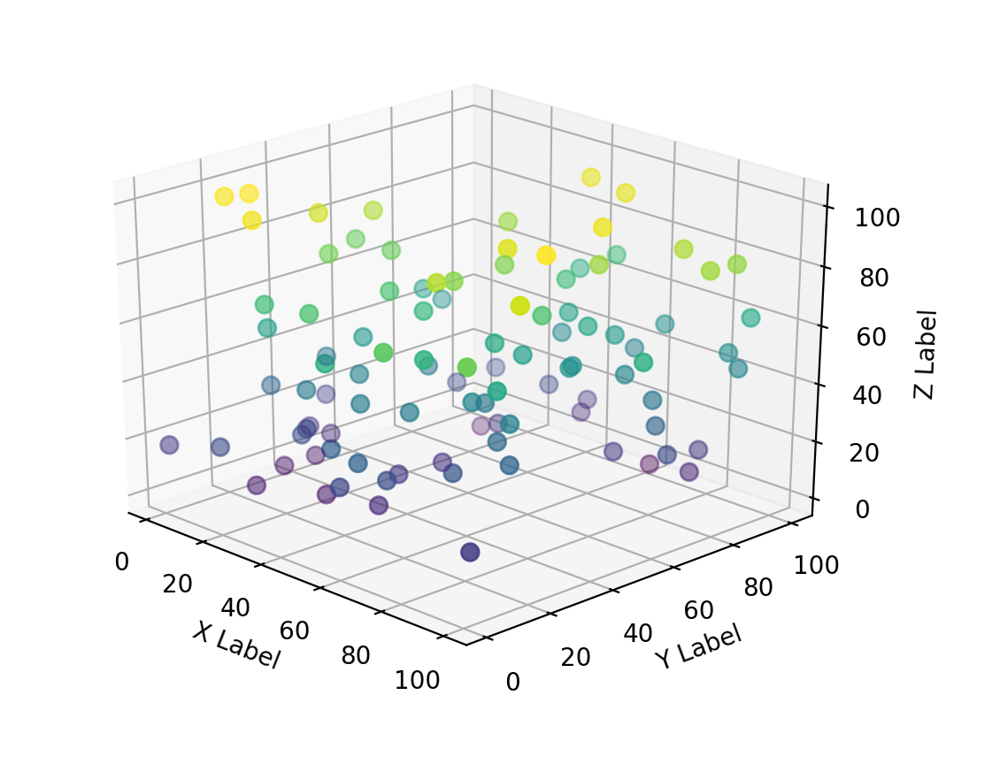
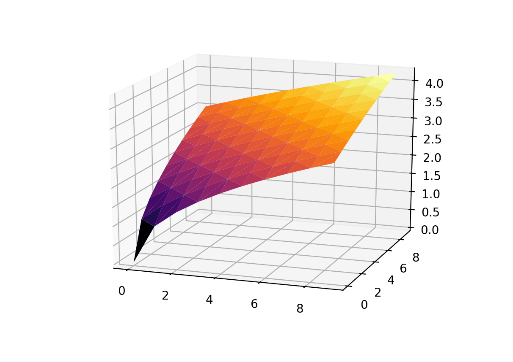

##### Week 10 Contents
- Presentation: [Algorithmic Graphics and Form](readme.md)
- Code: [Coding an Image](image.md)
- Code: [MatPlotLib 3D](matplotlib3d.md)
- Code: [Turtle Graphics](turtle.md)
- Code: [Heightfields](heightfield.md)

-----

### 3D Scatter Plots in MatPlotLib

Same as 2D Plots! 



```python
#for plotting
import matplotlib.pyplot as plt
#for random numbers
import random
#module for projecting and interatation in 3D 
from mpl_toolkits.mplot3d import Axes3D

#create a figure for plotting content into
fig = plt.figure()
#create a subplot in a 1x1x1 arrangement, in 3D
ax = fig.add_subplot(111, projection='3d')

#number of data points
n = 100

#empty lists for populating
x = []
y = []
z = []

#loop to fill up the lists
for i in range(n):
    x.append(random.randint(0,100))
    y.append(random.randint(0,100))
    z.append(random.randint(0,100))

#scatter the points in 3d
#s is radius in pixels at default zoom level
#c is the value to use with the colormap
#cmap is the colormap
ax.scatter(x, y, z, s=50, c=z, cmap="viridis")

#set labels on axes
ax.set_xlabel('Width')
ax.set_ylabel('Depth')
ax.set_zlabel('Height')

#show the plot!
plt.show()
```

### Surface Plotting

Many [complex 3D surfaces](https://matplotlib.org/mpl_toolkits/mplot3d/tutorial.html#mplot3d-tutorial) are possible in MatPlotLib.

For example, a 3D triangulated surface based on a grid of points...



```python
#for 3d projection and interaction
from mpl_toolkits.mplot3d import Axes3D
#for plotting
import matplotlib.pyplot as plt
#for faster processing and power
import numpy as np

import random

#make a figure
fig = plt.figure()
#set up an subplot in 3D 
ax = ax = fig.add_subplot(111, projection='3d')

x = []
y = []
z = []

#construct data
for i in range(10):
	for j in range(10):
		#create a regular grid of points
		x.append(i)
		y.append(j)
		#take square root of position for smoothish surface, normally this would be your data to plot
		z.append( (i+j)**.5 )


# Plot the delaunay triangulation surface
surf = ax.plot_trisurf(x, y, z, cmap='inferno', antialiased=True)

#show the plot!
plt.show()
```
