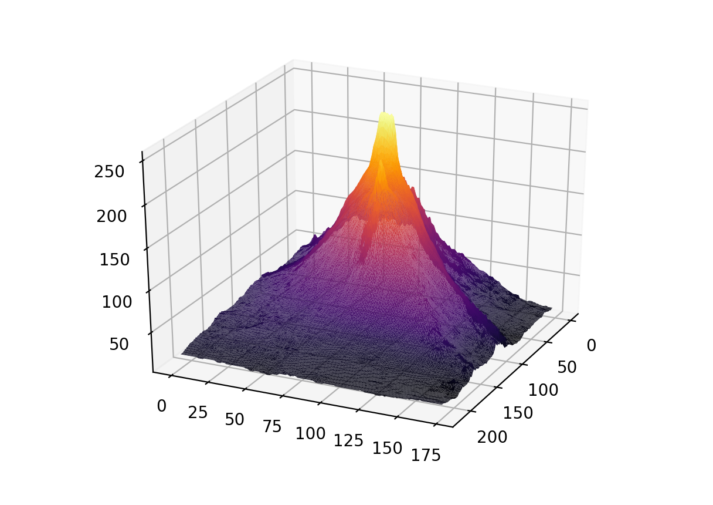

##### Week 10 Contents
- Presentation: [Algorithmic Graphics and Form](readme.md)
- Code: [Coding an Image](image.md)
- Code: [MatPlotLib 3D](matplotlib3d.md)
- Code: [Heightfields](heightfield.md)
- Homework: [LED Strips, Image Manipulation, Short Readings, and Heightfields](homework.md)

-----

We're looking at a bunch of inter-related topics this week, all of which orbit the relationship between code, pattern, and 2D/3D form.

-----

### References

- [Interactive Boids](http://www.harmendeweerd.nl/boids/)
- [Desire Lines](https://en.wikipedia.org/wiki/Desire_path)
- [Parametric Semiology](https://www.patrikschumacher.com/Texts/Design%20of%20Information%20Rich%20Environments.html)
- [How Animals See the World](https://www.youtube.com/watch?v=-ss-nmT7oAA)
- [*Color Oracle* Color Vision Impairment Simulator](https://colororacle.org)
- Cynthia Brewer's [Color Brewer 2](http://www.colorbrewer2.org)
- MatPlotLib's [Color Maps](https://matplotlib.org/3.1.0/tutorials/colors/colormaps.html)
- [OpenSCAD](https://www.openscad.org/index.html)
- Amazing [List of 3D Data Physicalizations](http://dataphys.org/list/) through history 
