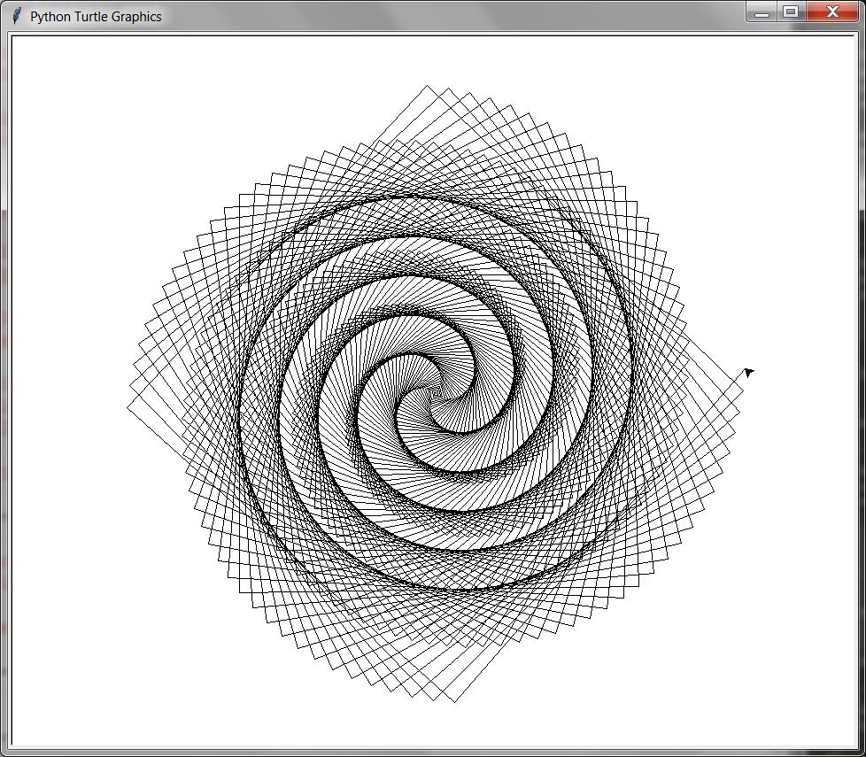

##### Week 10 Contents
- Presentation: [Algorithmic Graphics and Form](readme.md)
- Code: [Coding an Image](image.md)
- Code: [MatPlotLib 3D](matplotlib3d.md)
- Code: [Turtle Graphics](turtle.md)
- Code: [Heightfields](heightfield.md)

-----

### Turtles!

Take a look at this [awesome tutorial set](https://github.com/asweigart/simple-turtle-tutorial-for-python/blob/master/simple_turtle_tutorial.md) as well as the [official documentation](https://docs.python.org/3/library/turtle.html).

Have fun with this one! 

