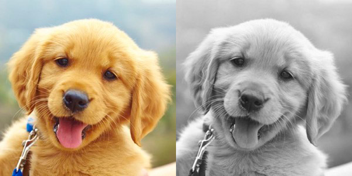
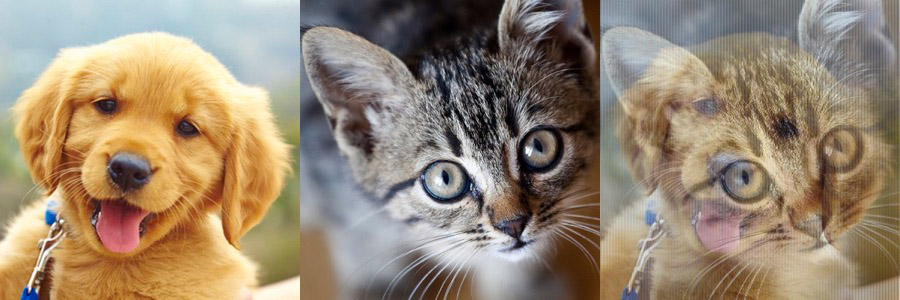

##### Week 11 Contents

-----

##### Homework Review

1. First, create a script that converts a color image to a grayscale image. Could you then write a script that does the reverse, and creates red/green/blue color versions from grayscale images like [Photoshop's Hue/Saturation Colorize Adjustment](https://helpx.adobe.com/photoshop-elements/using/adjusting-color-saturation-hue-vibrance.html#adjust_saturation_and_hue)? Hint for both: consider borrowing the `computeBrightness` function from the [edge detection](image.md) example. 

	To grayscale:
	 >  

	From grayscale to green (see commented lines in the `for` loop):
	 >  

```python
from PIL import Image
#necessary for fast list manipulation
import itertools

#open an image
img = Image.open("sourceImage.jpg")

#get rgb pixel data out of image
pixels = list(img.getdata())

#extract native image size
width, height = img.size

# simple perceptual luminance algorithm from here...
# https://www.scantips.com/lumin.html
def computeBrightness(rgb):
	return ( (rgb[0] * .3) + (rgb[1] * .59) + (rgb[2] * .11) )

#loop through all pixel
for i in range(len(pixels)) :
	#get the perceptual brightness of the pixel
	pixelBrightness = int(computeBrightness(pixels[i]))
	#set all rgb values to the same number, which creates grayscale colors
	pixels[i] = (pixelBrightness,pixelBrightness,pixelBrightness)

	#if, instead of grayscale, we wanted the green version of the image, we could just draw pixels with...
	#pixels[i] = (0,pixelBrightness,0)
	
#utility to flatten the list of pixel tuples into a single dimensional list
#from [(r,g,b),(r,g,b),(r,g,b)...] to [r,g,b,r,g,b,r,g,b]
pixels = list(itertools.chain.from_iterable(pixels))

#convert integers to bytes, necessary for Pillow
pixels = bytes(pixels)

#make an image! we could use a different mode for grayscale, but then Photoshop is weird... 
img = Image.frombytes('RGB', (width,height), pixels)

#use the system image viewer to open the resulting image
img.show()

#save the file to disk
img.save('grayscale.jpg')
```

-----

2. Create a script that removes all *red color* from an image and replaces it with *green*. 

```python
from PIL import Image
#necessary for fast list manipulation
import itertools

#open an image
img = Image.open("sourceImage.jpg")

#get rgb pixel data out of image
pixels = list(img.getdata())

#extract native image size
width, height = img.size

#loop through all pixel data
for i in range(len(pixels)) :
	#get the individual color channel data
	red = pixels[i][0]
	green = pixels[i][1]
	blue = pixels[i][2]

	#find red pixels and replace their red intensity with green at equivalent brightness
	if (red > green) and (red > blue) :
		pixels[i] = (0, red, blue)
	else :	
		#fully remove red otherwise
		pixels[i] = (0, green, blue)
	
#utility to flatten the list of pixel tuples into a single dimensional list
#from [(r,g,b),(r,g,b),(r,g,b)...] to [r,g,b,r,g,b,r,g,b]
pixels = list(itertools.chain.from_iterable(pixels))

#convert integers to bytes, necessary for Pillow
pixels = bytes(pixels)

#make an image! 
img = Image.frombytes('RGB', (width,height), pixels)

#use the system image viewer to open the resulting image
img.show()

#save the file to disk
img.save('redToGreen.jpg')
```

Could you extend this to be more flexible, partially recreating [Photoshop's Selective Color Adjustment](https://photographypla.net/introduction-selective-color-adjustment/)? Hint: consider using the HSV color space rather than RGB!

 > 

```python
from PIL import Image
#necessary for fast list manipulation
import itertools
import colorsys

#open an image
img = Image.open("sourceImage.jpg")

#get rgb pixel data out of image
pixels = list(img.getdata())

#extract native image size
width, height = img.size

#loop through all pixel data
for i in range(len(pixels)) :
	#get color channel data
	red = pixels[i][0]
	green = pixels[i][1]
	blue = pixels[i][2]

	#convert to HSV
	#colorsys defines colors as floats between 0 and 1 so we need to divide by 255 to convert
	hsvColor = colorsys.rgb_to_hsv( red / 255, green / 255, blue / 255)

	#find colors between 0% and 30% along the rainbow (basically from red to yellow). This selects which colors are impacted.
	if (hsvColor[0] > 0) and (hsvColor[0] < .3) :
		#rotate the hue by adding onto it, and if it goes above 1, divide by 1 and take the remainder
		#try changing what gets added on to shift to different colors
		newHue = (hsvColor[0] + .4) % 1
		#multiply by 255 and convert to int, as required by Pillow
		pixels[i] = ( int( newHue*255), int(hsvColor[1]*255), int(hsvColor[2]*255) )
	else :
		#these pixels are left alone
		pixels[i] = ( int(hsvColor[0]*255), int(hsvColor[1]*255), int(hsvColor[2]*255) )
	
#utility to flatten the list of pixel tuples into a single dimensional list
#from [(r,g,b),(r,g,b),(r,g,b)...] to [r,g,b,r,g,b,r,g,b]
pixels = list(itertools.chain.from_iterable(pixels))

#convert integers to bytes, necessary for Pillow
pixels = bytes(pixels)

#make an image! Note that we're telling Pillow that our data is HSV, not RGB!
img = Image.frombytes('HSV', (width,height), pixels)

#use the system image viewer to open the resulting image
img.show()

#save the file to disk. We need to convert to RGB, as JPGs cannot natively contain HSV data.
img.convert('RGB').save('hueSpin.jpg')
```

-----

3. Create a [heightfield of your own](heightfield.md) based on an image, or on a part of the world downloaded from [terrain.party](http://terrain.party)? 
	
	Usable code [here](../week10/heightfield.md).

-----

4. Could you write a script that takes two images of equal pixel dimensions, and combines the two together into a new image with alternating pixels? 

	 +  = 

```python
from PIL import Image
#necessary for fast list manipulation
import itertools

#open an image
imgOne = Image.open("sourceImage1.jpg")
imgTwo = Image.open("sourceImage2.jpg")

#extract native size of image one 
width, height = imgOne.size

#resize imgTwo to the size of imgOne
imgTwo.resize((width,height), resample=0)

#get rgb pixel data out of images
imageDataOne = list(imgOne.getdata())
imageDataTwo = list(imgTwo.getdata())

#empty list to hold synthesized image data
mergedImage = []

#how many pixels from image 1 for every pixel of image 2?
#this would allow patterns like aabaabaab or aaaaabaaaaab...
frequency = 2

#loop through all pixels from first image
for i in range(len(imageDataOne)) :
	#the % modulo operator returns the remainder of the division problem
	#5%2 = 1, 6%2 = 0, 17%6 = 5...
	#commonly, we use this operator to check for even/odd numbers by doing n%2 == 0
	if i % frequency == 0:
		mergedImage.append(imageDataTwo[i])
	else:
		mergedImage.append(imageDataOne[i])

#utility to flatten the list of pixel tuples into a single dimensional list
#from [(r,g,b),(r,g,b),(r,g,b)...] to [r,g,b,r,g,b,r,g,b]
mergedImage = list(itertools.chain.from_iterable(mergedImage))

#convert integers to bytes, necessary for Pillow
mergedImage = bytes(mergedImage)

#make an image! 
img = Image.frombytes('RGB', (width,height), mergedImage)

#use the system image viewer to open the resulting image
img.show()

#save the file to disk
img.save('merged.jpg')
```