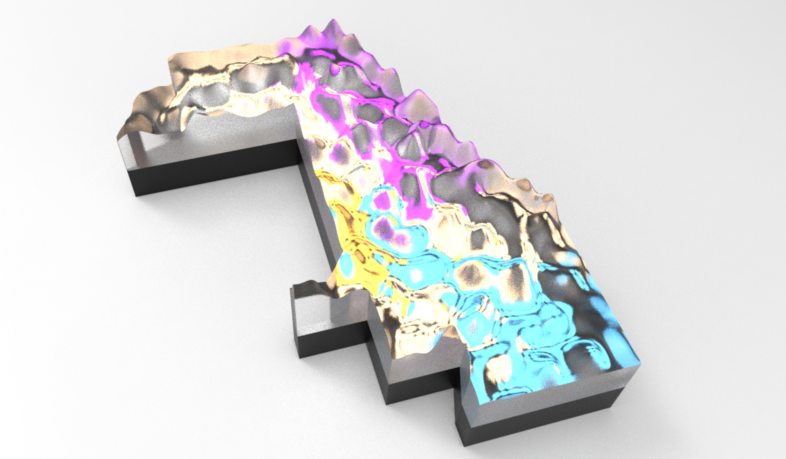

##### Week 11 Contents
- Presentation: [Procedural Graphics](readme.md)
- Code: [Turtle Graphics](turtle.md)
- Project Plan: [Project](project.md)
- Homework Review: [Image Routines and RGB LED Strips](homework-review.md)
- Homework: [Individual Heightfield Plan, Additions to Model Concept](homework.md)

-----

### Schedule!

Schedule for the rest of the semester

11/05 · Turtles, Project Plan
11/12 · Class CNC Intro 
11/19 · I2C Sensors and Dataset Production
11/26 · (Optional) Sound and Music Synthesis
12/03 · Final Class

11/13 or 11/20 or 11/27 (or another time scheduled) · Individal CNC milling

### Individual Project! 

Everyone is asked to produce a small heightfield model, designed to be cut from a 6" x 6" x 2" acrylic stock. These heightfields will be illuminated from below with an LED array, and can be lit by either... 

1. Some [dynamic?] real life data source such as census data or other apis

2. An animated pattern of your own design

The construction will be completed with the help of shop staff, a shared schematic, and digital fabrication equipment. 

Check out the work of [Adrien Segal](https://www.adriensegal.com) and [Stephen Cartwright Studio](http://stephencartwrightstudio.blogspot.com/2015/05/acrylic-milling.html) for more formal references.

------

### Big Project! 

The small heightfields are prototypes for a larger, site-specific installation. Our content work through the semester will be the seed for this installation, which will focus on visualizing policy-level transit interventions.

Towards this end, students are asked to submit the following content as a 500-1000 word paper, with data visualizations produced from Python and matplotlib explicating some or all of the following questions:

1. What design-level or policy-level interventions would make for a more inclusive transit system in Chicago?
2. What parameters of Chicago's demographic makeup lead some areas to need more transit support than others?
3. How would we evaluate in data the efficacy of a design intervention? 
4. What aspects of Chicago's existing transit infranstructure should be exposed as variables for designers to consider?

