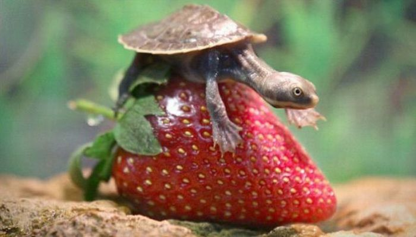

##### Week 11 Contents
- Presentation: [Procedural Graphics](readme.md)
- Code: [Turtle Graphics](turtle.md)
- Project Plan: [Project](project.md)
- Homework Review: [Image Routines and RGB LED Strips](homework-review.md)
- Homework: [Individual Heightfield Plan, Additions to Model Concept](homework.md)

-----

Let's review image synthesis/modification, and image-based 3D forms while — importantly — engaging the sheer power of the turtle (and the fundamentals of object-oriented programming).

-----

### References

stuff always comes up during class... wait for it! 
- [Pen Plotters!](https://www.youtube.com/watch?v=iziP0cQhOFY)
- [Intro to Pen Plotters](http://www.tobiastoft.com/posts/an-intro-to-pen-plotters)
- [Chiplotle](http://chiplotle.org)
- [Braille Lego](https://design-milk.com/lego-launches-braille-bricks-for-children-to-learn-braille/)