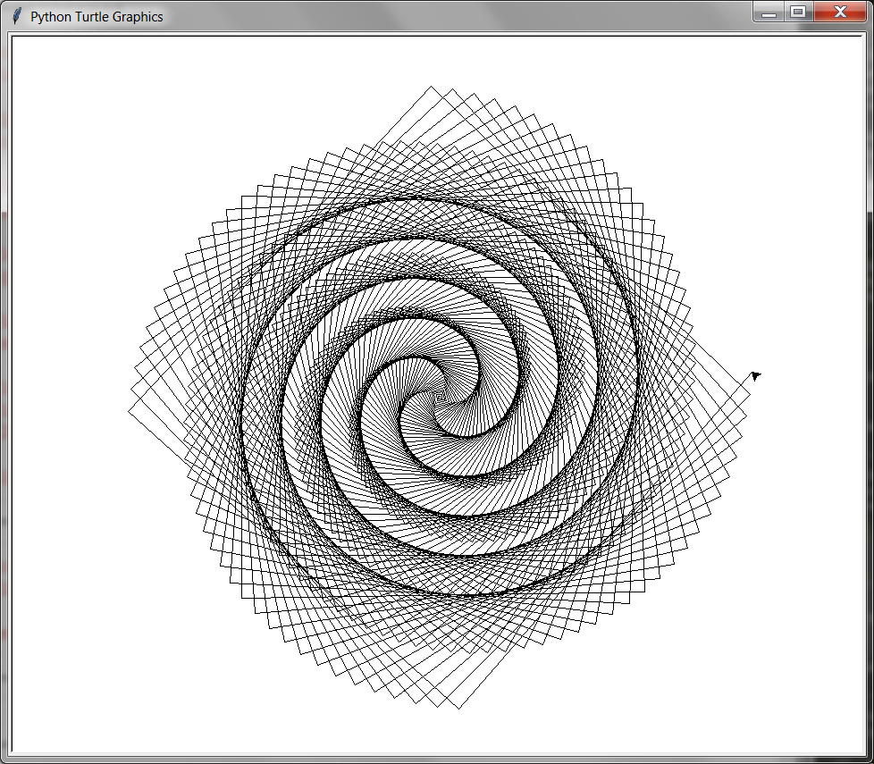

##### Week 11 Contents
- Presentation: [Procedural Graphics](readme.md)
- Code: [Turtle Graphics](turtle.md)
- Project Plan: [Project](project.md)
- Homework Review: [Image Routines and RGB LED Strips](homework-review.md)
-----

### Turtles!

[Turtle graphics](https://en.wikipedia.org/wiki/Turtle_graphics) is a branch of procedural computer science anchored in [object oriented programming](https://en.wikipedia.org/wiki/Object-oriented_programming), a more recent and specialized branch of the tree of coding than most of our [procedural programming](https://en.wikipedia.org/wiki/Procedural_programming) logic to date. Not much changes, but we need to work a bit differently than in other coding contexts and manage our data in different ways.

Artists have [long been inspired](https://en.wikipedia.org/wiki/Algorithmic_art) by how computers process and manipulate images, leading many to create graphics and artworks with the aid of [computer algorithms](http://www.complexification.net/gallery/machines/substrate/) and [mark-making and sculpting machines](https://drawingmachines.org/category.php?id=35). These artists are naturally also fascinated by the questions of authorship and agency embedded in these works.

Turtle graphics is a module included Python that allows robust image production according to a set of structured instructions. It is easy to learn, and its outcomes are boundless. It is often the first thing that Python teachers teach to young programmers, though it is certainly different than most codign contexts. Start with its [official documentation](https://docs.python.org/3/library/turtle.html), though there are many other tutorials that could be useful in understanding how to best draw with *turtle power*. Take a look at this [awesome tutorial set](https://github.com/asweigart/simple-turtle-tutorial-for-python/blob/master/simple_turtle_tutorial.md) especially after mastering the basics.

Have fun with this one! 

