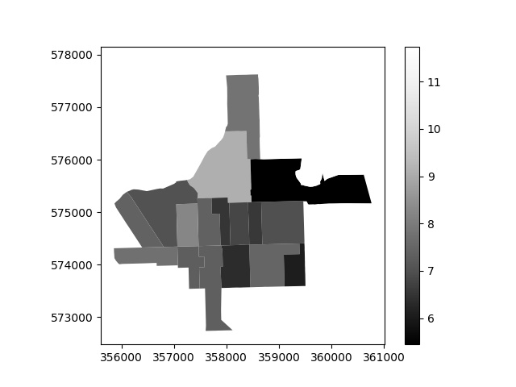

##### Week 12 Contents
- Presentation: [Project Plan](readme.md)
- Presentation: [Milling References](milling.md)
- Code: [Example Choropleth Generator Code](choropleth.md)
- Code: [Better MatPlotLib Heightfields](surface-plot.md)
- Code: [Alternative Mayavi Heightfields](mayavi-hf.md)
- Code: [Example Project Code](project.md)
- Homework: Get to it!

-----

This code shows how to generate a simple choropleth based on manipulable ACS data. More info [here](../week07/readme.md).



Make sure to add your **census key**, and ensure you have the [necessary tracts shapefile](https://www.chicago.gov/city/en/depts/doit/dataset/boundaries_-_censustracts.html) downloaded and placed next to your code. These filenames change as the map files get updated, so you may need to change the name of the folder and .shp file in your code.

```python
#necessary modules
import requests
import json
import time
import matplotlib.pyplot as plt
import geopandas as gpd
import pandas as pd
import numpy as np

#key for census API
censusKey = ""

#census variables of interest
dataPoints = "B18105_002E,B18105_004E,B18105_007E,B18105_010E,B18105_013E"

#construct census API
#17 is FIPS for Illinois, 031 is FIPS for Cook County
url = "https://api.census.gov/data/2017/acs/acs5?get=NAME,B01001_001E," + dataPoints + "&for=tract:*&in=state:17&in=county:031&key=" + censusKey

#grab data and parse
censusResponse = requests.get(url).json()

#create empty list as a future data container
dataList = []

#loop through census data -- note that we start at index "1" because the first data entry is a header row
for i in range (1, len(censusResponse)) : 

	#skip row, as there is no population at this census tract 
	if censusResponse[i][1] == "0":
		#skip!
		pass
	#all the rows that show a population
	else:
		#create dictionary of meaningful data pre-computed
		dataList.append(
			{
				"name": censusResponse[i][0],
				"totalPopulation": int(censusResponse[i][1]),
				"totalMale": int(censusResponse[i][2]),
				"5-17": int(censusResponse[i][3]),
				"18-34": int(censusResponse[i][4]),
				"35-64": int(censusResponse[i][5]),
				"65-74": int(censusResponse[i][6]),
				"totalMaleAmbulatoryDisability": int(censusResponse[i][3]) + int(censusResponse[i][4]) + int(censusResponse[i][5]) + int(censusResponse[i][6]),
				"percentageMaleAmbulatoryDisability": ( int(censusResponse[i][3]) + int(censusResponse[i][4]) + int(censusResponse[i][5]) + int(censusResponse[i][6]) ) / int(censusResponse[i][1]),
				"tractCode" : censusResponse[i][9],
				"sqrtPop": (int(censusResponse[i][1]))**.5
			}
		)


#convert data into a pandas data frame, which is like an excel table in code
frame = pd.DataFrame(dataList) 

#load shapefile and reproject to a better map projection
#get file here... https://www.chicago.gov/city/en/depts/doit/dataset/boundaries_-_censustracts.html
#click on red menu button and then "Download" and then "Shapefile"
#change name to folder and .shp file if needed
#you can look up EPSG map projection coded here...
#https://spatialreference.org
#2790 is a good choice for north-eastern IL
geography = gpd.read_file('bounds/geo_export_ea609890-7468-44a7-99ef-edc77453045d.shp').to_crs(epsg=2790)

#combine data! 
#left_on is the column header for the *geography*, the data receiving the merged data
#right_on is the column header in the data frame from the *census*, the data being injected in the merge
merged = geography.merge(frame, left_on='tractce10', right_on='tractCode')

#desired tract codes, all others get dropped out
tracts = [
	{"tractCode": "600900"},
	{"tractCode": "839800"},
	{"tractCode": "840000"},
	{"tractCode": "340500"},
	{"tractCode": "842000"},
	{"tractCode": "839500"},
	{"tractCode": "600600"},
	{"tractCode": "840200"},
	{"tractCode": "600400"},
	{"tractCode": "840100"},
	{"tractCode": "340300"},
	{"tractCode": "340400"},
	{"tractCode": "350400"},
	{"tractCode": "839200"},
	{"tractCode": "841100"},
	{"tractCode": "841000"},
	{"tractCode": "330200"},
	{"tractCode": "330100"}
]

#convert data into a pandas data frame, which is like an excel table in code
tracts = pd.DataFrame(tracts) 

#throw away all census tracts that aren't desired
cropped = merged[merged.tractCode.isin(tracts["tractCode"])]

#draw map!
#color maps here: https://matplotlib.org/3.1.0/tutorials/colors/colormaps.html
cropped.plot(column="sqrtPop", cmap='Greys_r', linewidth=0, legend=True)

#save as vector for AI with ".svg"
#save as raster for PS with ".jpg" or ".png"
plt.savefig("test.svg")
plt.savefig("test.jpg")

#plot title
plt.title("Choropleth")
#turn off axes display, doesn't make much sense for a map
plt.axis('off')

#show the stupid plot!
plt.show()
```