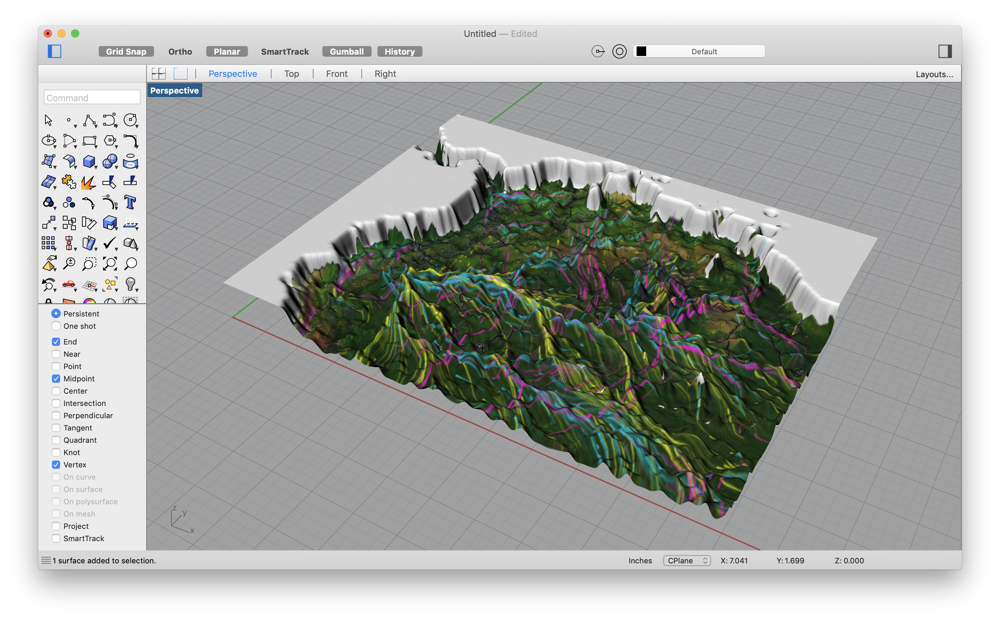
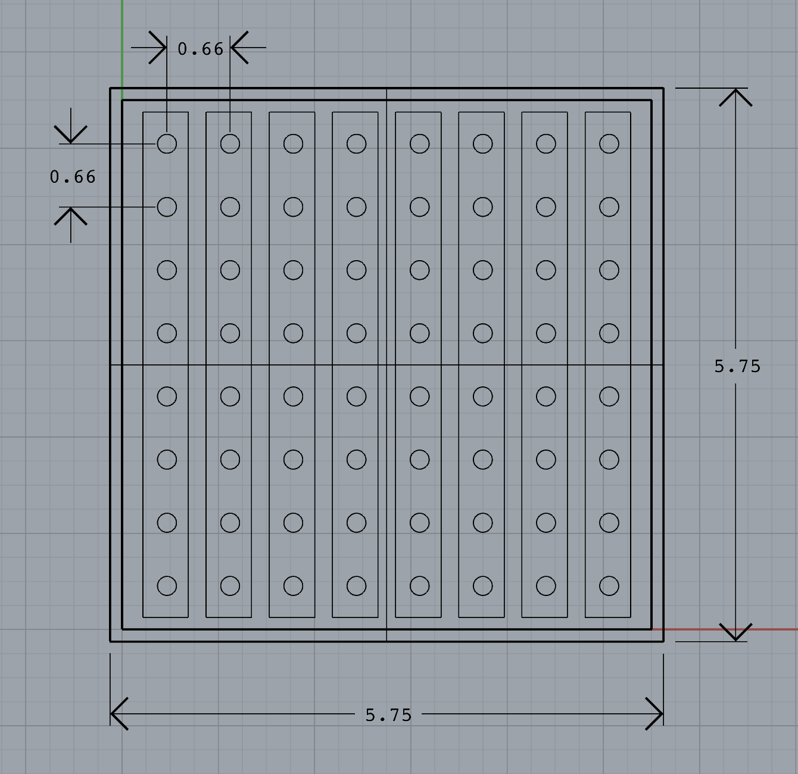
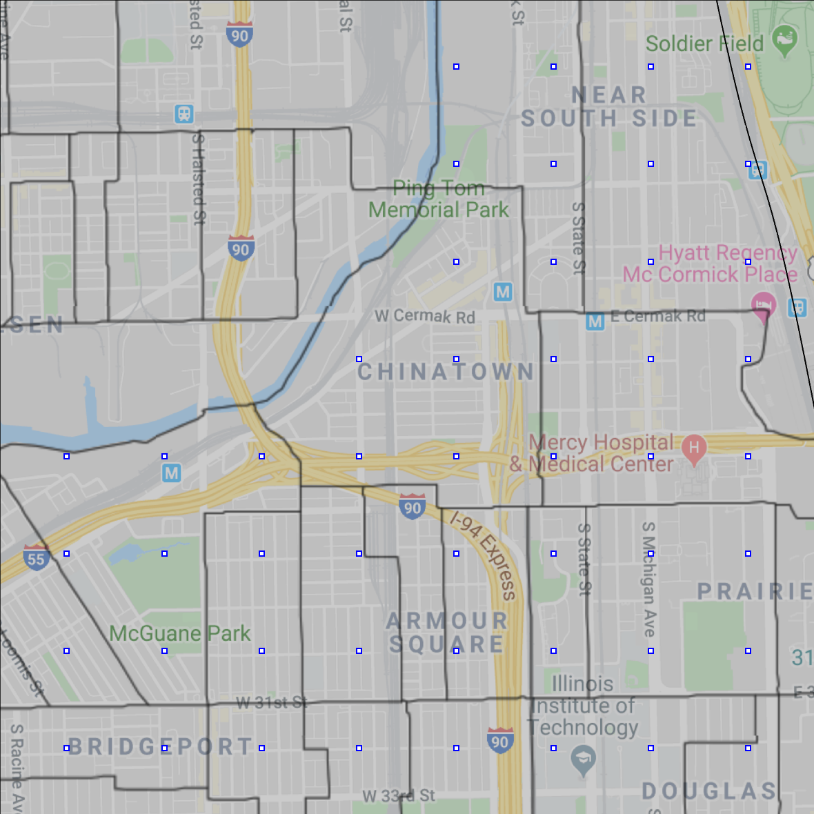
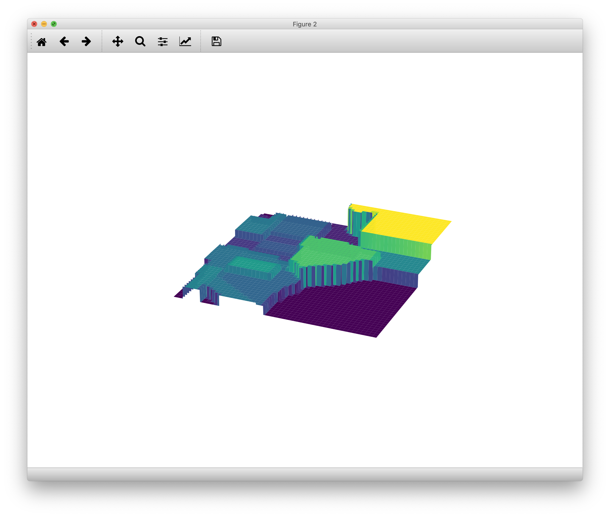
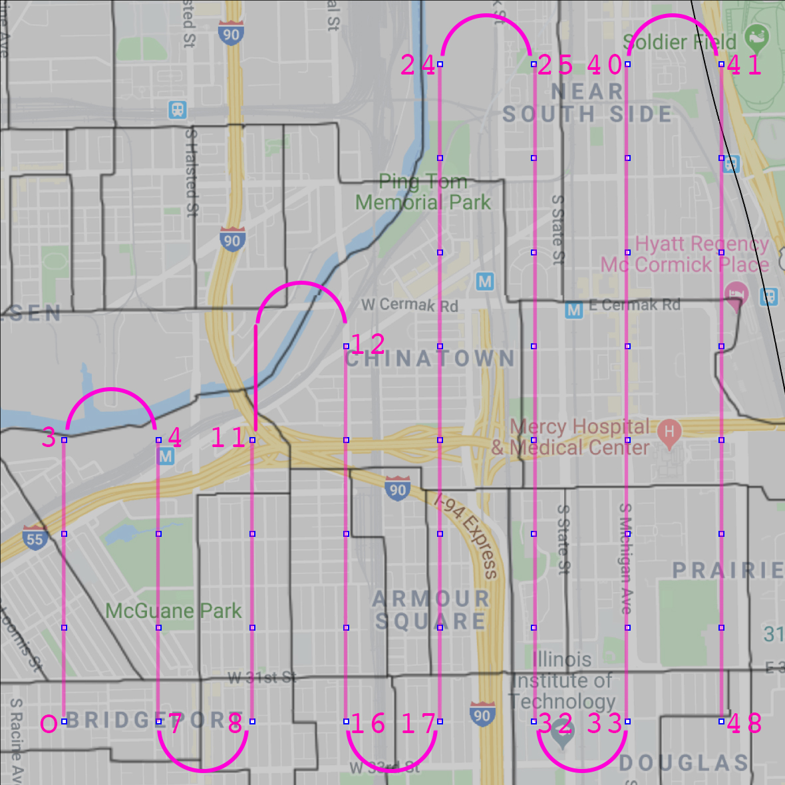

##### Week 12 Contents
- Presentation: [Project Plan](readme.md)
- Presentation: [Milling References](milling.md)
- Code: [Example Choropleth Generator Code](choropleth.md)
- Code: [Better MatPlotLib Heightfields](surface-plot.md)
- Code: [Alternative Mayavi Heightfields](mayavi-hf.md)
- Code: [Example Project Code](project.md)
- Homework: Get to it!

-----

Use the following steps as a rough guide for how to advance through the physical build out of our [final physical, CNC milled LED visualization project](../week11/project.md). 

-----

0. (If you have 3D modeling skills, feel free to model your own surface, and advance to step 3. It does not need to be an enclosed volume (the CNC is much more tolerant than 3D printers!), and should be modeled in inches to a 5.75"x5.75" X-Y bounding rectangle and located between .25" and 1.5" in Z). You can also use the [heightfield command](https://docs.mcneel.com/rhino/5/help/en-us/commands/heightfield.htm) if you know Rhino, and skip to step 5.



-----

1. Create or source a heightfield image.

	Find an image with Google image search, snap a screenshot, load something from a camera, visit [terrain.party](www.terrain.party)...any JPG or PNG will be fine! 

	Or, to make use of the many data sources we have discussed in class, create an image with matplotlib, geopandas, turtle, etc... If you are creating a choropleth map with Python, note the color map "Greys" and "Greys_r" which will use a linear grayscale map for coloring your image. Recall that low brightness maps to **low** and high brightness maps to **high** 3D geometry.

	

-----

2. Prepare your image. 

	If necessary, since heightfields use only brightness and not color, convert the image to a grayscale RGB image. In Photoshop, `Image -> Mode -> Grayscale` to throw away color information. Then, convert **back** to RGB so that Pillow can work with the image natively `Image -> Mode -> RGB Color`. If you receive a Pillow error `'int' object is not subscriptable`, it is because your image is not in RGB color mode. These steps are often required if you are working with [www.terrain.party](www.terrain.party) data images.

-----

3. Check, based on your image, what a single LED will represent. And, if that's no good, re-evaluate Step 1.
	
	For example, since the spacing of LEDs on the LED strip is around 16.54mm, we can at our densest create a grid of 64 LEDs (8x8) in our 6"x6" box. So, if representing geography, you can do some simple math. `visualized width / 8` and `visualized height / 8` will give you your effective resolution.

	

	Experimentally, a region slightly smaller than 2 miles by 2 miles tends to work well for most of Chicago, though more populous areas might need tighter bounding boxes. This is close to a 16 by 16 city block region of the city, according to [Chicago's regular address system](https://www.chicagorailfan.com/majorst.html), which makes each LED represent a square quarter mile — roughly a set of four city blocks. To give a more real example, the example demonstrated here is bounded by the following streets...

	```
	       18th
	Racine      King Drive
	       34th
	```

	And, running the math, a single LED represents the north turnstile exit of the 35th-Bronzeville-IIT Green Line stop at its southeast corner and the Kaplan Institute at its Northwest.

	Alternatively, you can visually make the decision! If you look at this map of [census tracts](https://www.chicago.gov/city/en/depts/doit/dataset/boundaries_-_censustracts.html), you can try to visualize how an 8x8 grid could be used to light up a meaningful set of tracts or geography. You can also use [mapshaper](https://mapshaper.org) with this [shapefile](https://www.chicago.gov/city/en/depts/doit/dataset/boundaries_-_censustracts.html) for more precision.

	

	You can definitely go larger, though. If you wanted to show data relating to the contiguous United States, distinguishing the layout of the complicatedly drawn state boundaries might be difficult, especially in the northeast where the states are small. But you can [intentionally design a map distortion](http://fivethirtyeight.com/features/where-your-state-gets-its-money/) based on a grid or other pattern. You could also light up [census divisions or regions](https://www.census.gov/prod/1/gen/95statab/preface.pdf) instead of the states — a geographic entity also supported by the ACS.

	It is also possible to place the LEDs in patterns other than grids, and instead lay the LEDs out in more [unusual paths](http://www.nicetrails.com) or geometries like rings, radial lines, or spirals by cutting and twisting the strips. In which case, the distance resolution along all the paths will likewise be set at a linear 16.54mm/.66" per LED.

-----

4. Add details to your heightfield image, if desired or necessary. 
	
	Paint in Photoshop with a black brush to push down to 0 height in 3D space, and a white brush to pull up to full height. The [dodge and burn brushes](https://helpx.adobe.com/photoshop/using/dodge-burn-image-areas.html) can be used to generally manipulate the height of areas interactively. This can be useful if you want to raise roads up, highlight specific buildings, push down subterranean train lines, or visualize in 3D form other natural/manmade boundaries. You can also layer images and play with [transparency blending modes](https://helpx.adobe.com/photoshop/using/blending-modes.html) to add more detail and blend images together.

-----

5. Take a look at your heightfield in code and mill it! 
	
	There are two new methods for more performative visualization based on a [quad surface (still a bit slow)](surface-plot.md), or using a different visualizer for much faster behavior [Mayavi](mayavi-hf.md). Still, try to resize the image to expedite prototyping, keeping it under 200px on its longest dimension until you are ready to finalize your design. Remember that your heightfield will be squished on its Z-dimension to 1.5" of variation at most. So, if you are seeing a large variation in height in your 3D surface, consider dividing Z by some (additional) scaling factor to get a feel for the real proportions.

	

	Send your heightfield image and Python code to Zach, and schedule a milling time (around an hour total)! 

-----

6. Connect your LEDs in a logical sequence to integer addresses (which LED is index 0? where is the end of the strip?). 

	Encode this is a list of dictionaries -- see the final code for an example. Consider that the next step will be soldering the strips together to create your pattern, so try to minimize connections required.

	

-----

7. Solder your LED grid or pattern based on the sequence above. Or, spend a few dollars on [3 pin, 12mm wide connectors](https://www.amazon.com/Connectors-GIDERWEL-Solderless-Connector-Cut-End/dp/B07VCDWKZT/ref=sr_1_6?crid=24ZVOPCADOE8A). 

-----

8. Build your box.
	
	Foamcore is rigid, is easy to modify if needed, and will illuminate nicely. Best to wait till after you've milled your heightfield before constructing anything final, due to possible dimensional variability. 

-----

8. Do you want to add any physical interactions? 

	Could a user control your data object through buttons or dials? If so, carefully drill holes in your box. Also drill a hole for power and data connections to your LED strips if your Raspberry Pi sits outside your box. This will make sense next week when we discuss buttons, sliders, and other input options other than the Raspberry Pi's USB ports.

-----

9. Assemble everything! 

-----

10. Write and edit your visualization code, source additional data, consider how your object might automatically animate...

	Take a look at [this code](project.md) as an example demonstrating data sourcing and static dataset loading, data merges, point-in-polygon calculations, and color animation/blending. 
